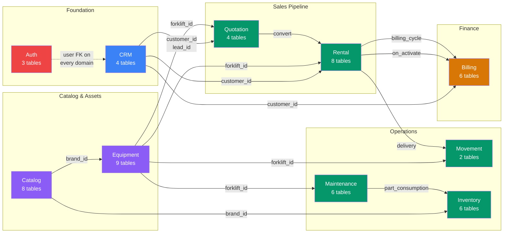
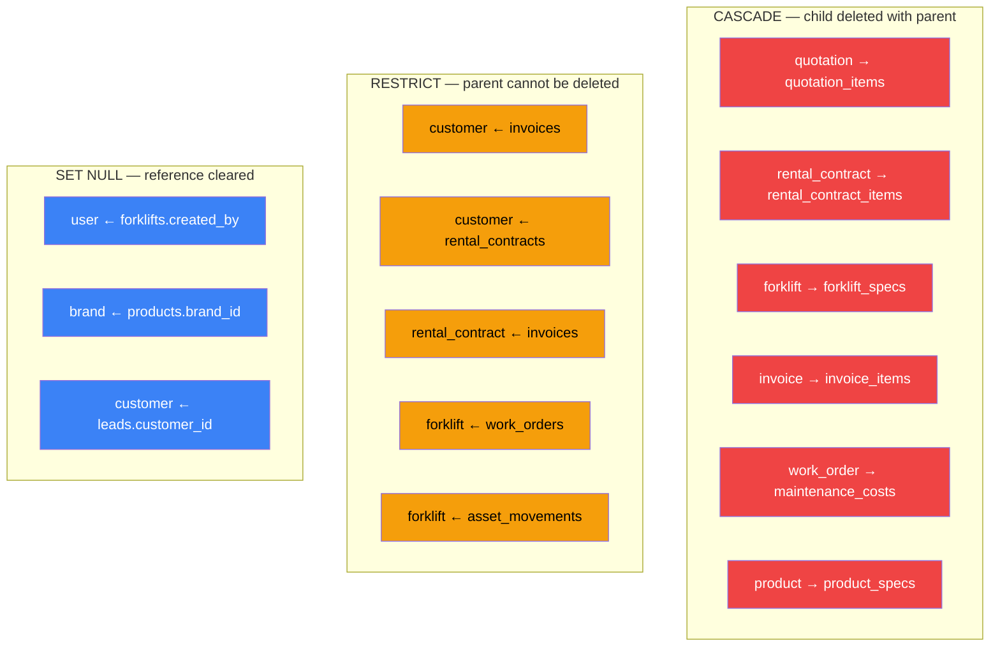

# ER Diagram — DK Service Enterprise Platform

> Rendered Mermaid source: [`er-diagram.mmd`](er-diagram.mmd) (all 56 tables with columns)

## Domain Map

## Table Counts by Domain

| # | Domain | Tables | Total Columns | FKs | Relationships |
|---|--------|--------|--------------|-----|---------------|
| 1 | Auth | 3 | 24 | 1 | users → roles |
| 2 | CRM | 4 | 38 | 7 | customers ← leads ← lead_notes, activity_logs |
| 3 | Catalog | 8 | 74 | 9 | brands → products ← categories, specs, images, compat, import |
| 4 | Equipment | 9 | 98 | 18 | forklifts ← specs, photos, docs, locations, hours, costs, status |
| 5 | Quotation | 4 | 60 | 12 | quotations ← items, approvals, status_history |
| 6 | Rental | 8 | 163 | 30 | contracts ← items, terms, status, extensions, returns, damage, cycles |
| 7 | Movement | 2 | 30 | 7 | movements ← movement_history |
| 8 | Maintenance | 6 | 74 | 14 | plans → schedules → work_orders ← costs, service_history, consumption |
| 9 | Inventory | 6 | 56 | 10 | parts ← balances, transactions, PO_items; warehouses; purchase_orders |
| 10 | Billing | 6 | 91 | 16 | invoices ← items, allocations; payments; deposits; revenue_recognitions |
| | **Total** | **56** | **708** | **124** | |

## Relationship Types

## FK Cascade Summary

| ON DELETE | Count | Pattern |
|-----------|-------|---------|
| CASCADE | 28 | All child/detail tables — items, specs, costs, history, notes |
| SET NULL | 78 | User references (created_by, assigned_to), optional brand/category/lead refs |
| RESTRICT | 8 | Critical financial links — invoices→contracts, invoices→customers, movements→forklifts, work_orders→forklifts |
| No explicit (DB default) | 10 | Early models (users.role_id, customers.assigned_to, leads FKs) — behaves as NO ACTION |

## Circular Reference Analysis

No true circular FKs exist. The closest pattern:
- `rental_contracts` → `billing_service` (runtime hook, not FK)
- `billing_service` reads `rental_billing_cycles` (FK is cycle→contract, one-directional)
- `quotations.converted_to_id` is a plain INTEGER with no FK constraint (polymorphic reference)

All FK chains are acyclic. Table creation order follows the dependency graph without conflicts.
