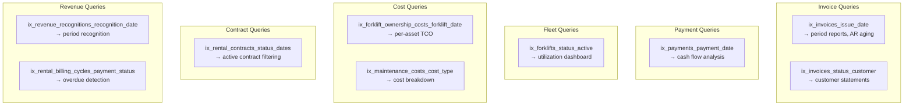

# Index Strategy — DK Service Enterprise Platform

## Overview

| Category | Count |
|----------|-------|
| Primary key indexes (implicit) | 56 |
| Unique constraint indexes | 26 |
| Explicit single-column indexes | ~70 |
| Proposed performance indexes | 9 |
| **Total** | **~161** |

---

## Index Inventory by Table

### Auth Domain

| Table | Index | Column(s) | Type |
|-------|-------|-----------|------|
| roles | PK | id | B-tree |
| roles | UNIQUE | name | B-tree |
| users | PK | id | B-tree |
| users | UNIQUE | email | B-tree |
| users | UNIQUE | username | B-tree |
| users | ix_users_role_id | role_id | B-tree |
| revoked_tokens | PK | id | B-tree |
| revoked_tokens | UNIQUE | jti | B-tree |

### CRM Domain

| Table | Index | Column(s) | Type |
|-------|-------|-----------|------|
| customers | PK | id | B-tree |
| customers | UNIQUE | email | B-tree |
| customers | ix_customers_status | status | B-tree |
| customers | ix_customers_assigned_to | assigned_to | B-tree |
| leads | PK | id | B-tree |
| leads | ix_leads_status | status | B-tree |
| leads | ix_leads_customer_id | customer_id | B-tree |
| leads | ix_leads_assigned_to | assigned_to | B-tree |
| lead_notes | PK | id | B-tree |
| lead_notes | ix_lead_notes_lead_id | lead_id | B-tree |
| activity_logs | PK | id | B-tree |
| activity_logs | ix_activity_logs_user_id | user_id | B-tree |
| activity_logs | ix_activity_logs_entity_type | entity_type | B-tree |
| activity_logs | ix_activity_logs_entity_id | entity_id | B-tree |
| activity_logs | ix_activity_logs_created_at | created_at | B-tree |

### Catalog Domain

| Table | Index | Column(s) | Type |
|-------|-------|-----------|------|
| brands | PK | id | B-tree |
| brands | UNIQUE | name | B-tree |
| brands | UNIQUE + ix_brands_slug | slug | B-tree |
| product_categories | PK | id | B-tree |
| product_categories | UNIQUE + ix | slug | B-tree |
| product_categories | ix_parent_id | parent_id | B-tree |
| products | PK | id | B-tree |
| products | UNIQUE + ix | sku | B-tree |
| products | UNIQUE + ix | slug | B-tree |
| products | ix_products_name_en | name_en | B-tree |
| products | ix_products_model_number | model_number | B-tree |
| products | ix_products_brand_id | brand_id | B-tree |
| products | ix_products_category_id | category_id | B-tree |
| products | ix_products_is_active | is_active | B-tree |
| product_specs | ix_product_specs_product_id | product_id | B-tree |
| product_images | ix_product_images_product_id | product_id | B-tree |
| product_compat_brands | ix_pcb_product_id | product_id | B-tree |
| product_compat_brands | ix_pcb_brand_id | brand_id | B-tree |
| import_errors | ix_import_errors_job_id | job_id | B-tree |

### Equipment Domain

| Table | Index | Column(s) | Type |
|-------|-------|-----------|------|
| forklift_models | UNIQUE + ix | slug | B-tree |
| forklift_models | ix_brand_id | brand_id | B-tree |
| forklifts | UNIQUE | serial_number | B-tree |
| forklifts | UNIQUE + ix | slug | B-tree |
| forklifts | UNIQUE | internal_code | B-tree |
| forklifts | ix_forklifts_model_id | model_id | B-tree |
| forklifts | ix_forklifts_brand_id | brand_id | B-tree |
| forklifts | ix_forklifts_customer_id | customer_id | B-tree |
| forklifts | ix_forklifts_status | status | B-tree |
| forklifts | ix_forklifts_is_active | is_active | B-tree |
| forklifts | ix_forklifts_name_en | name_en | B-tree |
| forklifts | ix_forklifts_model_number | model_number | B-tree |
| forklift_specs | ix_forklift_specs_forklift_id | forklift_id | B-tree |
| forklift_photos | ix_forklift_photos_forklift_id | forklift_id | B-tree |
| forklift_documents | ix_fd_forklift_id | forklift_id | B-tree |
| forklift_documents | ix_fd_expiry_date | expiry_date | B-tree |
| forklift_locations | ix_fl_forklift_id | forklift_id | B-tree |
| forklift_locations | ix_fl_effective_date | effective_date | B-tree |
| forklift_hour_meter_logs | ix_fhml_forklift_id | forklift_id | B-tree |
| forklift_hour_meter_logs | ix_fhml_recorded_at | recorded_at | B-tree |
| forklift_ownership_costs | ix_foc_forklift_id | forklift_id | B-tree |
| forklift_ownership_costs | ix_foc_cost_type | cost_type | B-tree |
| forklift_ownership_costs | ix_foc_cost_date | cost_date | B-tree |
| forklift_status_history | ix_fsh_forklift_id | forklift_id | B-tree |
| forklift_status_history | ix_fsh_changed_at | changed_at | B-tree |

### Quotation, Rental, Movement, Maintenance, Inventory, Billing

> All FK columns have indexes. All status columns have indexes. All `_number` UNIQUE columns have indexes. All `created_at` / `changed_at` / `recorded_at` timestamp columns used in sorting have indexes.

---

## Proposed Performance Indexes (Additive Migration)

These 9 indexes are defined in `migration-001-performance-indexes.py` (revision `a1b2c3d4e5f6`). They target aggregation queries for profitability calculations and executive dashboards.

| # | Index Name | Table | Columns | Query Pattern |
|---|-----------|-------|---------|---------------|
| 1 | `ix_invoices_issue_date` | invoices | (issue_date) | `WHERE issue_date BETWEEN ? AND ?` |
| 2 | `ix_invoices_status_customer` | invoices | (status, customer_id) | `WHERE status = ? AND customer_id = ?` |
| 3 | `ix_payments_payment_date` | payments | (payment_date) | `WHERE payment_date BETWEEN ? AND ?` |
| 4 | `ix_forklifts_status_active` | forklifts | (status, is_active) | `WHERE status = ? AND is_active = TRUE` |
| 5 | `ix_forklift_ownership_costs_forklift_date` | forklift_ownership_costs | (forklift_id, cost_date) | `WHERE forklift_id = ? ORDER BY cost_date` |
| 6 | `ix_maintenance_costs_cost_type` | maintenance_costs | (cost_type) | `GROUP BY cost_type` |
| 7 | `ix_rental_contracts_status_dates` | rental_contracts | (status, start_date, end_date) | `WHERE status = 'active' AND start_date <= ? AND end_date >= ?` |
| 8 | `ix_revenue_recognitions_recognition_date` | revenue_recognitions | (recognition_date) | `WHERE recognition_date BETWEEN ? AND ?` |
| 9 | `ix_rental_billing_cycles_payment_status` | rental_billing_cycles | (payment_status) | `WHERE payment_status = 'pending' AND due_date < NOW()` |

## Index Design Principles

| Principle | Implementation |
|-----------|---------------|
| Every FK gets an index | SQLAlchemy `index=True` on all FK columns |
| Every UNIQUE gets an index | Implicit with UNIQUE constraint |
| Status columns indexed | Filter-heavy columns: `status`, `payment_status`, `is_active` |
| Timestamp columns for sorting | `created_at`, `changed_at`, `recorded_at`, `cost_date` |
| Composite indexes for common joins | `(status, customer_id)`, `(forklift_id, cost_date)`, `(status, start_date, end_date)` |
| No covering indexes | Kept simple — table is narrow enough for index + heap lookup |
| No partial indexes | PostgreSQL supports them but not needed at current data volumes |
