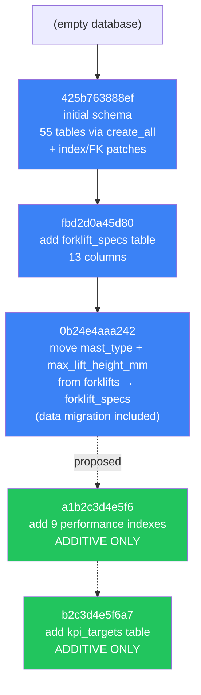
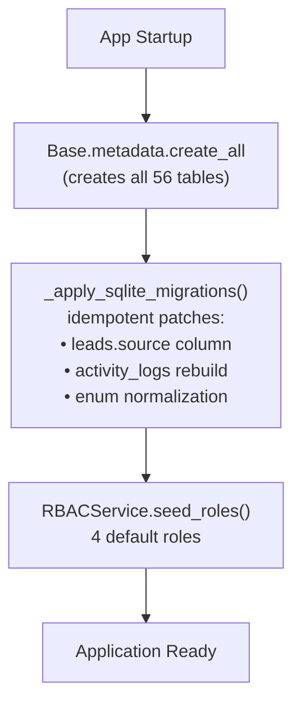
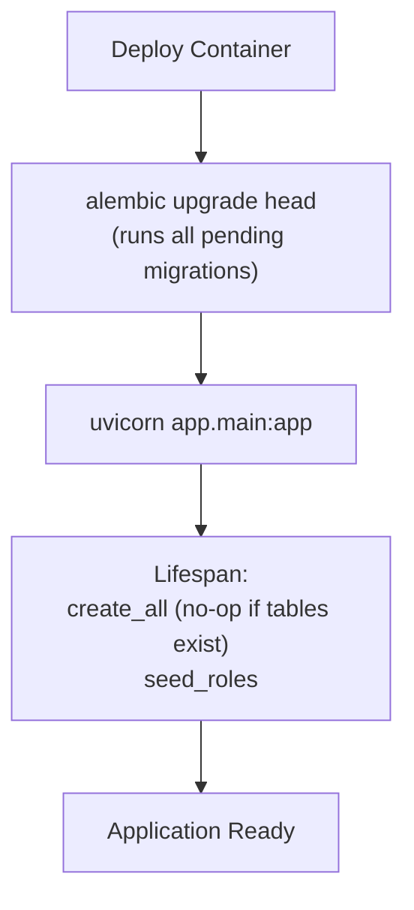

# Migration Order — DK Service Enterprise Platform

## 1. Current Alembic Chain



| Revision | Description | Type | Reversible |
|----------|-------------|------|-----------|
| `425b763888ef` | Initial schema — patches existing SQLite tables (alter activity_logs.details to JSON, add indexes on leads) | Patch | Yes (downgrade restores TEXT type, removes indexes) |
| `fbd2d0a45d80` | Add `forklift_specs` table with 11 columns + 2 indexes | Additive | Yes (drops table) |
| `0b24e4aaa242` | Move mast_type/max_lift_height_mm from forklifts to forklift_specs. Includes data migration SQL. | Structural | Yes (moves data back, drops columns, re-adds to forklifts) |
| `a1b2c3d4e5f6` | 9 performance indexes for aggregation queries | **Additive** | Yes (drops 9 indexes) |
| `b2c3d4e5f6a7` | New `kpi_targets` table (8 columns + 4 indexes) | **Additive** | Yes (drops table + indexes) |

---

## 2. Table Creation Order (Dependency-Sorted)

Tables must be created in this order to satisfy FK constraints. Tables at the same level can be created in any order.

```
Level 0 (no FKs):
    roles
    brands
    warehouses
    maintenance_plans

Level 1 (depends on Level 0):
    users                       → roles
    product_categories          → self (parent_id)
    forklift_models             → brands
    spare_parts                 → brands

Level 2 (depends on Level 1):
    customers                   → users
    revoked_tokens              (no FKs)
    products                    → brands, product_categories, users
    import_jobs                 → users

Level 3 (depends on Level 2):
    leads                       → customers, users
    product_specs               → products
    product_images              → products
    product_compat_brands       → products, brands
    import_errors               → import_jobs
    forklifts                   → forklift_models, brands, customers, users
    activity_logs               → users
    inventory_balances          → spare_parts, warehouses
    inventory_transactions      → spare_parts, warehouses, users
    purchase_orders             → warehouses, users

Level 4 (depends on Level 3):
    lead_notes                  → leads, users
    forklift_specs              → forklifts
    forklift_photos             → forklifts, users
    forklift_documents          → forklifts, users
    forklift_locations          → forklifts, customers, users
    forklift_hour_meter_logs    → forklifts, users
    forklift_ownership_costs    → forklifts, users
    forklift_status_history     → forklifts, users
    purchase_order_items        → purchase_orders, spare_parts
    maintenance_schedules       → forklifts, maintenance_plans
    quotations                  → customers, leads, users, self (parent_id)

Level 5 (depends on Level 4):
    quotation_items             → quotations, forklifts, products
    quotation_approvals         → quotations, users
    quotation_status_history    → quotations, users
    work_orders                 → forklifts, maintenance_schedules, maintenance_plans, users
    rental_contracts            → quotations, customers, leads, users

Level 6 (depends on Level 5):
    rental_contract_items       → rental_contracts, forklifts, quotation_items
    rental_contract_terms       → rental_contracts
    rental_contract_status_history → rental_contracts, users
    rental_extensions           → rental_contracts, users
    rental_billing_cycles       → rental_contracts, rental_contract_items, users
    maintenance_costs           → work_orders
    service_history             → forklifts, work_orders, users
    part_consumptions           → spare_parts, warehouses, work_orders, forklifts, users
    asset_movements             → forklifts, rental_contracts, customers, users

Level 7 (depends on Level 6):
    rental_returns              → rental_contracts, rental_contract_items, forklifts, users
    movement_history            → asset_movements, users
    invoices                    → rental_contracts, customers, users
    payments                    → customers, rental_contracts, users

Level 8 (depends on Level 7):
    rental_damage_reports       → rental_returns, rental_contracts, forklifts, users
    invoice_items               → invoices, rental_billing_cycles
    payment_allocations         → payments, invoices, users
    deposits                    → rental_contracts, customers, payments, users
    revenue_recognitions        → invoices, invoice_items, rental_contracts, users
```

---

## 3. Development vs Production Migration Strategy

### Development (SQLite)



- No Alembic needed — `create_all` handles everything
- SQLite-specific PRAGMA and table rebuild in `_apply_sqlite_migrations()`
- Idempotent — safe to run on every startup

### Production (PostgreSQL)



- Alembic manages all schema changes
- `create_all` is a no-op when tables already exist
- Migrations are run before app startup (in Dockerfile CMD or entrypoint script)

---

## 4. Migration Safety Rules

| Rule | Rationale |
|------|-----------|
| **Additive only** | Never drop existing columns or tables in production |
| **No existing table modifications** | All 56 current tables are frozen |
| **New indexes only** | Never drop an existing index |
| **New tables only** | Never rename an existing table |
| **Data migrations include rollback** | Every upgrade() has a matching downgrade() |
| **Test on SQLite first** | Verify create_all still works after model changes |
| **Alembic autogenerate, then review** | Never blindly apply autogenerated migrations |

---

## 5. Applying New Migrations

### From Current Head (`0b24e4aaa242`)

```bash
# Step 1: Copy migration scripts to alembic/versions/
cp docs/database/migration-001-performance-indexes.py \
   backend/alembic/versions/a1b2c3d4e5f6_performance_indexes.py

cp docs/database/migration-002-kpi-targets.py \
   backend/alembic/versions/b2c3d4e5f6a7_kpi_targets.py

# Step 2: Verify chain
cd backend
alembic history

# Expected output:
# b2c3d4e5f6a7 -> (head), add kpi_targets table
# a1b2c3d4e5f6 -> b2c3d4e5f6a7, add performance indexes
# 0b24e4aaa242 -> a1b2c3d4e5f6, move mast_type...
# fbd2d0a45d80 -> 0b24e4aaa242, add forklift_specs
# <base> -> fbd2d0a45d80, initial schema

# Step 3: Apply
alembic upgrade head

# Step 4: Verify
alembic current
# → b2c3d4e5f6a7 (head)
```

### Rollback

```bash
# Revert kpi_targets only:
alembic downgrade a1b2c3d4e5f6

# Revert indexes too:
alembic downgrade 0b24e4aaa242

# Both are safe:
# - Migration 001 only adds indexes (DROP INDEX in downgrade)
# - Migration 002 only adds a table (DROP TABLE in downgrade)
# - No existing data is affected
```

---

## 6. Future Migration Guidelines

When adding new features per the refactor plan:

### Phase 9 — Profitability (no new tables needed)

Profitability calculations use existing tables:
- Revenue: `invoices.amount_paid`, `deposits.forfeit_amount`
- Costs: `forklift_ownership_costs.amount`, `maintenance_costs.amount`, `part_consumptions.total_cost`

No migration required. Service layer performs aggregation queries.

### Phase 10 — Executive BI

The `kpi_targets` table is already covered by migration 002.

### Future — Technician Entity (if approved)

```bash
# Generate migration:
alembic revision --autogenerate -m "add technicians table"

# Review the generated file
# Ensure it's additive (CREATE TABLE only)
# Ensure downgrade drops the table

# Apply:
alembic upgrade head
```

### Future — Customer Code Field (if approved)

```bash
# Generate migration:
alembic revision --autogenerate -m "add customer_code to customers"

# This will generate:
# op.add_column('customers', sa.Column('customer_code', sa.String(20), nullable=True, unique=True))
# op.create_index('ix_customers_customer_code', 'customers', ['customer_code'])

# Additive — adds a nullable column, no existing data affected
```

---

## 7. Migration Verification Checklist

After applying any migration:

```
[ ] alembic current shows expected revision
[ ] uvicorn app.main:app starts without error
[ ] GET /health returns {"status": "healthy"}
[ ] Existing CRUD operations still work (create/read/update/delete a customer)
[ ] New tables/indexes are visible: \dt and \di in psql
[ ] Downgrade works: alembic downgrade -1, then re-upgrade
```
