# API Design — Technical Design Specification

### Request Flow

```mermaid
graph LR
    SPA["React SPA"] -->|"HTTP + Bearer"| CORS["CORS"]
    CORS --> ReqID["RequestID"]
    ReqID --> Bearer["HTTPBearer"]
    Bearer --> JWT["JWT Decode"]
    JWT --> Revoke["Revocation Check"]
    Revoke --> UserLoad["Load User"]
    UserLoad --> Perm["require_permission()"]
    Perm --> Route["Route Handler"]
    Route --> Schema["Pydantic Validation"]
    Schema --> Service["Service Layer"]
    Service --> Repo["Repository"]
    Repo --> DB[(Database)]

    classDef mw fill:#64748b,color:#fff
    classDef auth fill:#ef4444,color:#fff
    classDef logic fill:#7c3aed,color:#fff
    classDef data fill:#d97706,color:#fff
    class CORS,ReqID mw
    class Bearer,JWT,Revoke,UserLoad,Perm auth
    class Route,Schema,Service,Repo logic
    class DB data
```



## 1. API Conventions

| Convention | Value |
|-----------|-------|
| Base path | `/api/v1` |
| Auth | Bearer JWT in `Authorization` header |
| Content type | `application/json` (except file uploads: `multipart/form-data`) |
| Pagination | `page` (1-based), `page_size` (default 20, max 100) |
| Sorting | `sort` (field name), `order` (`asc`\|`desc`) |
| Search | `q` query parameter (partial match) |
| Filtering | Field-specific query params (e.g., `status`, `customer_id`) |
| Dates | ISO 8601 format (`YYYY-MM-DD` for dates, ISO datetime for timestamps) |
| Currency | 3-letter ISO code, default `LAK` |
| Soft delete | `is_active` flag, default `true` filter |

## 2. Response Patterns

### Single Entity

```json
{
  "id": 1,
  "field": "value",
  "created_at": "2026-01-15T10:30:00Z",
  "updated_at": null
}
```

### Paginated List

```json
{
  "items": [...],
  "total": 150,
  "page": 1,
  "page_size": 20,
  "pages": 8
}
```

### Error Response

```json
{
  "detail": "Error message or validation array",
  "error_id": "a1b2c3d4e5f6"
}
```

## 3. Complete Endpoint Inventory (218 endpoints)

### Auth — `/auth` (3 endpoints)

| Method | Path | Permission | Response |
|--------|------|-----------|----------|
| POST | `/auth/login` | Public | TokenResponse |
| POST | `/auth/logout` | Authenticated | 204 |
| POST | `/auth/refresh` | Public (refresh token) | TokenResponse |

### Users — `/users` (6 endpoints)

| Method | Path | Permission | Response |
|--------|------|-----------|----------|
| GET | `/users/me` | Authenticated | UserOut |
| GET | `/users` | Superuser | list[UserOut] |
| POST | `/users` | Superuser | UserOut |
| GET | `/users/{id}` | Superuser | UserOut |
| PATCH | `/users/{id}` | Superuser | UserOut |
| DELETE | `/users/{id}` | Superuser | 204 |

### Roles — `/roles` (6 endpoints)

| Method | Path | Permission | Response |
|--------|------|-----------|----------|
| GET | `/roles/permissions` | Authenticated | PermissionMatrixOut |
| GET | `/roles` | Authenticated | list[RoleOut] |
| POST | `/roles` | MANAGE_USERS | RoleOut |
| GET | `/roles/{id}` | Authenticated | RoleWithPermissionsOut |
| PATCH | `/roles/{id}` | MANAGE_USERS | RoleOut |
| DELETE | `/roles/{id}` | MANAGE_USERS | 204 |

### Customers — `/customers` (5 endpoints)

| Method | Path | Permission | Response |
|--------|------|-----------|----------|
| GET | `/customers` | Authenticated | list[CustomerOut] |
| POST | `/customers` | CREATE_CUSTOMER | CustomerOut |
| GET | `/customers/{id}` | Authenticated | CustomerOut |
| PATCH | `/customers/{id}` | EDIT_CUSTOMER | CustomerOut |
| DELETE | `/customers/{id}` | DELETE_CUSTOMER | 204 |

### Leads — `/leads` (8 endpoints)

| Method | Path | Permission | Response |
|--------|------|-----------|----------|
| GET | `/leads` | Authenticated | list[LeadOut] |
| POST | `/leads` | CREATE_LEAD | LeadOut |
| GET | `/leads/{id}` | Authenticated | LeadDetail |
| PUT | `/leads/{id}` | EDIT_LEAD | LeadOut |
| DELETE | `/leads/{id}` | DELETE_LEAD | 204 |
| GET | `/leads/{id}/notes` | Authenticated | list[LeadNoteOut] |
| POST | `/leads/{id}/notes` | Authenticated | LeadNoteOut |
| DELETE | `/leads/{id}/notes/{nid}` | Authenticated | 204 |

### Activity — `/activity` (4 endpoints)

| Method | Path | Permission | Response |
|--------|------|-----------|----------|
| GET | `/activity` | Superuser | list[ActivityLogOut] |
| GET | `/activity/me` | Authenticated | list[ActivityLogOut] |
| GET | `/activity/entity/{type}/{id}` | Authenticated | list[ActivityLogOut] |
| GET | `/activity/user/{id}` | Superuser | list[ActivityLogOut] |

### Dashboard — `/dashboard` (4 endpoints)

| Method | Path | Permission | Response |
|--------|------|-----------|----------|
| GET | `/dashboard/summary` | VIEW_DASHBOARD | DashboardSummary |
| GET | `/dashboard/lead-trend` | VIEW_DASHBOARD | list[TrendPoint] |
| GET | `/dashboard/customer-trend` | VIEW_DASHBOARD | list[TrendPoint] |
| GET | `/dashboard/lead-metrics` | VIEW_DASHBOARD | LeadMetrics |

### Reports — `/reports` (3 endpoints)

| Method | Path | Permission | Response |
|--------|------|-----------|----------|
| GET | `/reports/customers` | VIEW_DASHBOARD | StreamingResponse (CSV/Excel) |
| GET | `/reports/leads` | VIEW_DASHBOARD | StreamingResponse |
| GET | `/reports/sales` | VIEW_DASHBOARD | StreamingResponse |

### Catalog — `/catalog` (30 endpoints)

**Brands** — `/catalog/brands` (5)

| Method | Path | Permission | Response |
|--------|------|-----------|----------|
| GET | `/catalog/brands` | Authenticated | list[BrandOut] |
| POST | `/catalog/brands` | MANAGE_CATALOG | BrandOut |
| GET | `/catalog/brands/{id}` | Authenticated | BrandOut |
| PUT | `/catalog/brands/{id}` | MANAGE_CATALOG | BrandOut |
| DELETE | `/catalog/brands/{id}` | MANAGE_CATALOG | 204 |

**Categories** — `/catalog/categories` (6)

| Method | Path | Permission | Response |
|--------|------|-----------|----------|
| GET | `/catalog/categories` | Authenticated | list[CategoryTree] |
| GET | `/catalog/categories/flat` | Authenticated | list[CategoryOut] |
| POST | `/catalog/categories` | MANAGE_CATALOG | CategoryOut |
| GET | `/catalog/categories/{id}` | Authenticated | CategoryOut |
| PUT | `/catalog/categories/{id}` | MANAGE_CATALOG | CategoryOut |
| DELETE | `/catalog/categories/{id}` | MANAGE_CATALOG | 204 |

**Products** — `/catalog/products` (13)

| Method | Path | Permission | Response |
|--------|------|-----------|----------|
| GET | `/catalog/products` | Authenticated | ProductListResponse |
| GET | `/catalog/products/{id}` | Authenticated | ProductDetail |
| POST | `/catalog/products` | MANAGE_CATALOG | ProductOut |
| PUT | `/catalog/products/{id}` | MANAGE_CATALOG | ProductOut |
| DELETE | `/catalog/products/{id}` | MANAGE_CATALOG | 204 |
| POST | `/catalog/products/{id}/specs` | MANAGE_CATALOG | SpecOut |
| PUT | `/catalog/products/{id}/specs/{sid}` | MANAGE_CATALOG | SpecOut |
| DELETE | `/catalog/products/{id}/specs/{sid}` | MANAGE_CATALOG | 204 |
| POST | `/catalog/products/{id}/images` | MANAGE_CATALOG | ImageOut |
| PUT | `/catalog/products/{id}/images/{iid}` | MANAGE_CATALOG | ImageOut |
| DELETE | `/catalog/products/{id}/images/{iid}` | MANAGE_CATALOG | 204 |
| POST | `/catalog/products/{id}/compat-brands` | MANAGE_CATALOG | CompatBrandOut |
| DELETE | `/catalog/products/{id}/compat-brands/{cid}` | MANAGE_CATALOG | 204 |

**Import** — `/catalog/products/import` (6)

| Method | Path | Permission | Response |
|--------|------|-----------|----------|
| POST | `/catalog/products/import/preview` | MANAGE_CATALOG | ImportPreviewResponse |
| POST | `/catalog/products/import/{job_id}/execute` | MANAGE_CATALOG | ImportExecuteResponse |
| POST | `/catalog/products/import` | MANAGE_CATALOG | ImportExecuteResponse |
| GET | `/catalog/products/import/jobs` | MANAGE_CATALOG | list[ImportJobOut] |
| GET | `/catalog/products/import/jobs/{id}` | MANAGE_CATALOG | ImportJobDetail |
| DELETE | `/catalog/products/import/jobs/{id}` | MANAGE_CATALOG | 204 |

### Equipment — `/forklifts` (21 endpoints)

| Method | Path | Permission | Response |
|--------|------|-----------|----------|
| GET | `/forklifts` | FORKLIFT_READ | ForkliftListResponse |
| GET | `/forklifts/{id}` | FORKLIFT_READ | ForkliftDetail |
| POST | `/forklifts` | FORKLIFT_CREATE | ForkliftOut |
| PUT | `/forklifts/{id}` | FORKLIFT_UPDATE | ForkliftOut |
| DELETE | `/forklifts/{id}` | FORKLIFT_DELETE | 204 |
| GET | `/forklifts/{id}/status-history` | FORKLIFT_READ | list[StatusHistoryOut] |
| GET | `/forklifts/{id}/locations` | FORKLIFT_READ | list[LocationOut] |
| POST | `/forklifts/{id}/locations` | FORKLIFT_UPDATE | LocationOut |
| GET | `/forklifts/{id}/hour-meter-logs` | FORKLIFT_READ | list[HourMeterLogOut] |
| POST | `/forklifts/{id}/hour-meter-logs` | FORKLIFT_UPDATE | HourMeterLogOut |
| GET | `/forklifts/{id}/documents` | FORKLIFT_READ | list[DocumentOut] |
| POST | `/forklifts/{id}/documents` | FORKLIFT_UPDATE | DocumentOut |
| GET | `/forklifts/{id}/photos` | FORKLIFT_READ | list[PhotoOut] |
| POST | `/forklifts/{id}/photos` | FORKLIFT_UPDATE | PhotoOut |
| GET | `/forklifts/{id}/costs` | FORKLIFT_READ | list[CostOut] |
| GET | `/forklifts/{id}/costs/summary` | FORKLIFT_READ | CostSummary |
| POST | `/forklifts/{id}/costs` | FORKLIFT_UPDATE | CostOut |
| GET | `/forklifts/{id}/specs` | FORKLIFT_READ | list[SpecOut] |
| POST | `/forklifts/{id}/specs` | FORKLIFT_UPDATE | SpecOut |
| PUT | `/forklifts/{id}/specs/{sid}` | FORKLIFT_UPDATE | SpecOut |
| DELETE | `/forklifts/{id}/specs/{sid}` | FORKLIFT_UPDATE | 204 |

### Uploads — `/uploads` (1 endpoint)

| Method | Path | Permission | Response |
|--------|------|-----------|----------|
| POST | `/uploads/images` | FORKLIFT_UPDATE | `{url, filename, original_name, size, content_type}` |

### Quotations — `/quotations` (20 endpoints)

| Method | Path | Permission | Response |
|--------|------|-----------|----------|
| GET | `/quotations` | QUOTATION_READ | QuotationListResponse |
| GET | `/quotations/{id}` | QUOTATION_READ | QuotationDetail |
| POST | `/quotations` | QUOTATION_CREATE | QuotationOut |
| PUT | `/quotations/{id}` | QUOTATION_UPDATE | QuotationOut |
| DELETE | `/quotations/{id}` | QUOTATION_DELETE | 204 |
| GET | `/quotations/{id}/items` | QUOTATION_READ | list[ItemOut] |
| POST | `/quotations/{id}/items` | QUOTATION_UPDATE | ItemOut |
| PUT | `/quotations/{id}/items/{iid}` | QUOTATION_UPDATE | ItemOut |
| DELETE | `/quotations/{id}/items/{iid}` | QUOTATION_UPDATE | 204 |
| POST | `/quotations/{id}/submit` | QUOTATION_UPDATE | QuotationOut |
| POST | `/quotations/{id}/approve` | QUOTATION_APPROVE | QuotationOut |
| POST | `/quotations/{id}/reject` | QUOTATION_APPROVE | QuotationOut |
| POST | `/quotations/{id}/send` | QUOTATION_UPDATE | QuotationOut |
| POST | `/quotations/{id}/accept` | QUOTATION_UPDATE | QuotationOut |
| POST | `/quotations/{id}/decline` | QUOTATION_UPDATE | QuotationOut |
| POST | `/quotations/{id}/convert` | QUOTATION_CONVERT | QuotationOut |
| POST | `/quotations/{id}/cancel` | QUOTATION_UPDATE | QuotationOut |
| POST | `/quotations/{id}/reactivate` | QUOTATION_UPDATE | QuotationOut |
| GET | `/quotations/{id}/status-history` | QUOTATION_READ | list[StatusHistoryOut] |
| GET | `/quotations/{id}/approvals` | QUOTATION_READ | list[ApprovalOut] |

### Rental Contracts — `/rental-contracts` (34 endpoints)

| Method | Path | Permission | Response |
|--------|------|-----------|----------|
| GET | `/rental-contracts` | RENTAL_READ | ListResponse |
| GET | `/rental-contracts/{id}` | RENTAL_READ | Detail |
| POST | `/rental-contracts` | RENTAL_CREATE | Out |
| PUT | `/rental-contracts/{id}` | RENTAL_UPDATE | Out |
| DELETE | `/rental-contracts/{id}` | RENTAL_DELETE | 204 |
| GET | `/{id}/items` | RENTAL_READ | list[ItemOut] |
| POST | `/{id}/items` | RENTAL_UPDATE | ItemOut |
| PUT | `/{id}/items/{iid}` | RENTAL_UPDATE | ItemOut |
| DELETE | `/{id}/items/{iid}` | RENTAL_UPDATE | 204 |
| POST | `/{id}/submit` | RENTAL_UPDATE | Out |
| POST | `/{id}/approve` | RENTAL_APPROVE | Out |
| POST | `/{id}/reject` | RENTAL_APPROVE | Out |
| POST | `/{id}/activate` | RENTAL_DELIVER | Out |
| POST | `/{id}/cancel` | RENTAL_UPDATE | Out |
| POST | `/{id}/close` | RENTAL_SETTLE | Out |
| POST | `/convert-quotation` | RENTAL_CREATE | Out |
| GET | `/{id}/extensions` | RENTAL_READ | list[ExtOut] |
| POST | `/{id}/extensions` | RENTAL_UPDATE | ExtOut |
| POST | `/{id}/extensions/{eid}/approve` | RENTAL_APPROVE | ExtOut |
| POST | `/{id}/extensions/{eid}/reject` | RENTAL_APPROVE | ExtOut |
| GET | `/{id}/returns` | RENTAL_READ | list[ReturnOut] |
| POST | `/{id}/returns` | RENTAL_UPDATE | ReturnOut |
| PUT | `/{id}/returns/{rid}` | RENTAL_DELIVER | ReturnOut |
| POST | `/{id}/returns/{rid}/pickup` | RENTAL_DELIVER | ReturnOut |
| POST | `/{id}/returns/{rid}/receive` | RENTAL_DELIVER | ReturnOut |
| POST | `/{id}/returns/{rid}/complete` | RENTAL_INSPECT | ReturnOut |
| GET | `/{id}/damage-reports` | RENTAL_READ | list[DmgOut] |
| POST | `/{id}/damage-reports` | RENTAL_INSPECT | DmgOut |
| PUT | `/{id}/damage-reports/{did}` | RENTAL_INSPECT | DmgOut |
| POST | `/{id}/damage-reports/{did}/dispute` | RENTAL_UPDATE | DmgOut |
| POST | `/{id}/damage-reports/{did}/resolve-dispute` | RENTAL_SETTLE | DmgOut |
| GET | `/{id}/billing-cycles` | RENTAL_READ | list[CycleOut] |
| POST | `/{id}/billing-cycles` | RENTAL_SETTLE | CycleOut |
| GET | `/{id}/status-history` | RENTAL_READ | list[HistoryOut] |

### Movements — `/movements` (10 endpoints)

| Method | Path | Permission | Response |
|--------|------|-----------|----------|
| GET | `/movements` | FORKLIFT_READ | ListResponse |
| GET | `/movements/{id}` | FORKLIFT_READ | Detail |
| POST | `/movements` | FORKLIFT_UPDATE | Out |
| PUT | `/movements/{id}` | FORKLIFT_UPDATE | Out |
| POST | `/movements/{id}/prepare` | FORKLIFT_UPDATE | Out |
| POST | `/movements/{id}/depart` | FORKLIFT_UPDATE | Out |
| POST | `/movements/{id}/arrive` | FORKLIFT_UPDATE | Out |
| POST | `/movements/{id}/complete` | FORKLIFT_UPDATE | Out |
| POST | `/movements/{id}/cancel` | FORKLIFT_UPDATE | Out |
| POST | `/movements/{id}/checkpoint` | FORKLIFT_UPDATE | HistoryOut |

### Maintenance — `/maintenance` (17 endpoints)

| Method | Path | Permission | Response |
|--------|------|-----------|----------|
| GET | `/maintenance/dashboard` | FORKLIFT_READ | DashboardSummary |
| GET | `/maintenance/plans` | FORKLIFT_READ | list[PlanOut] |
| POST | `/maintenance/plans` | FORKLIFT_UPDATE | PlanOut |
| GET | `/maintenance/plans/{id}` | FORKLIFT_READ | PlanOut |
| PUT | `/maintenance/plans/{id}` | FORKLIFT_UPDATE | PlanOut |
| GET | `/maintenance/schedules` | FORKLIFT_READ | list[ScheduleOut] |
| POST | `/maintenance/schedules` | FORKLIFT_UPDATE | ScheduleOut |
| GET | `/maintenance/work-orders` | FORKLIFT_READ | WOListResponse |
| GET | `/maintenance/work-orders/{id}` | FORKLIFT_READ | WODetail |
| POST | `/maintenance/work-orders` | FORKLIFT_UPDATE | WOOut |
| PUT | `/maintenance/work-orders/{id}` | FORKLIFT_UPDATE | WOOut |
| POST | `/maintenance/work-orders/{id}/start` | FORKLIFT_UPDATE | WOOut |
| POST | `/maintenance/work-orders/{id}/complete` | FORKLIFT_UPDATE | WOOut |
| POST | `/maintenance/work-orders/{id}/verify` | FORKLIFT_UPDATE | WOOut |
| POST | `/maintenance/work-orders/{id}/cancel` | FORKLIFT_UPDATE | WOOut |
| POST | `/maintenance/work-orders/{id}/costs` | FORKLIFT_UPDATE | CostOut |
| GET | `/maintenance/service-history/{fid}` | FORKLIFT_READ | list[HistoryOut] |

### Inventory — `/inventory` (17 endpoints)

| Method | Path | Permission | Response |
|--------|------|-----------|----------|
| GET | `/inventory/dashboard` | MANAGE_CATALOG | DashboardSummary |
| GET | `/inventory/parts` | MANAGE_CATALOG | PartListResponse |
| GET | `/inventory/parts/{id}` | MANAGE_CATALOG | PartOut |
| POST | `/inventory/parts` | MANAGE_CATALOG | PartOut |
| PUT | `/inventory/parts/{id}` | MANAGE_CATALOG | PartOut |
| GET | `/inventory/warehouses` | MANAGE_CATALOG | list[WarehouseOut] |
| POST | `/inventory/warehouses` | MANAGE_CATALOG | WarehouseOut |
| GET | `/inventory/balances` | MANAGE_CATALOG | list[BalanceOut] |
| GET | `/inventory/transactions` | MANAGE_CATALOG | list[TransactionOut] |
| POST | `/inventory/transactions` | MANAGE_CATALOG | TransactionOut |
| GET | `/inventory/purchase-orders` | MANAGE_CATALOG | POListResponse |
| GET | `/inventory/purchase-orders/{id}` | MANAGE_CATALOG | POOut |
| POST | `/inventory/purchase-orders` | MANAGE_CATALOG | POOut |
| POST | `/inventory/purchase-orders/{id}/submit` | MANAGE_CATALOG | POOut |
| POST | `/inventory/purchase-orders/{id}/receive` | MANAGE_CATALOG | POOut |
| POST | `/inventory/consume` | MANAGE_CATALOG | ConsumptionOut |
| GET | `/inventory/consumptions` | MANAGE_CATALOG | list[ConsumptionOut] |

### Billing — `/billing` (29 endpoints)

| Method | Path | Permission | Response |
|--------|------|-----------|----------|
| GET | `/billing/invoices` | BILLING_READ | InvoiceListResponse |
| GET | `/billing/invoices/{id}` | BILLING_READ | InvoiceDetail |
| POST | `/billing/invoices` | BILLING_CREATE | InvoiceOut |
| PUT | `/billing/invoices/{id}` | BILLING_UPDATE | InvoiceOut |
| POST | `/billing/invoices/{id}/issue` | BILLING_UPDATE | InvoiceOut |
| POST | `/billing/invoices/{id}/send` | BILLING_UPDATE | InvoiceOut |
| POST | `/billing/invoices/{id}/cancel` | BILLING_UPDATE | InvoiceOut |
| POST | `/billing/invoices/{id}/void` | BILLING_APPROVE | InvoiceOut |
| POST | `/billing/invoices/from-billing-cycles` | BILLING_CREATE | InvoiceOut |
| GET | `/billing/payments` | BILLING_READ | PaymentListResponse |
| GET | `/billing/payments/{id}` | BILLING_READ | PaymentOut |
| POST | `/billing/payments` | BILLING_CREATE | PaymentOut |
| POST | `/billing/payments/{id}/confirm` | BILLING_APPROVE | PaymentOut |
| POST | `/billing/payments/{id}/reject` | BILLING_APPROVE | PaymentOut |
| POST | `/billing/payments/{id}/allocate` | BILLING_UPDATE | AllocationOut |
| GET | `/billing/deposits` | BILLING_READ | DepositListResponse |
| GET | `/billing/deposits/{id}` | BILLING_READ | DepositOut |
| POST | `/billing/deposits` | BILLING_CREATE | DepositOut |
| POST | `/billing/deposits/{id}/receive` | BILLING_UPDATE | DepositOut |
| POST | `/billing/deposits/{id}/refund` | BILLING_UPDATE | DepositOut |
| POST | `/billing/deposits/{id}/forfeit` | BILLING_APPROVE | DepositOut |
| POST | `/billing/deposits/{id}/apply` | BILLING_UPDATE | DepositOut |
| GET | `/billing/revenue-recognitions` | BILLING_READ | RecognitionListResponse |
| POST | `/billing/revenue-recognitions` | BILLING_CREATE | RecognitionOut |
| POST | `/billing/revenue-recognitions/{id}/recognize` | BILLING_APPROVE | RecognitionOut |
| POST | `/billing/revenue-recognitions/{id}/reverse` | BILLING_APPROVE | RecognitionOut |
| GET | `/billing/summary` | BILLING_READ | BillingDashboardSummary |
| POST | `/billing/contracts/{id}/generate-cycles` | BILLING_CREATE | list[CycleOut] |
| POST | `/billing/invoices/mark-overdue` | BILLING_UPDATE | `{marked_overdue: int}` |

### Health (1 endpoint)

| Method | Path | Permission | Response |
|--------|------|-----------|----------|
| GET | `/health` | Public | `{status, version, database}` |

## 4. New Endpoints (per refactor plan)

### Phase 9 — Profitability (4 new endpoints)

| Method | Path | Permission | Response |
|--------|------|-----------|----------|
| GET | `/profitability/fleet` | PROFITABILITY_READ | FleetProfitabilityList |
| GET | `/profitability/assets/{id}` | PROFITABILITY_READ | AssetProfitability |
| GET | `/profitability/contracts/{id}` | PROFITABILITY_READ | ContractProfitability |
| GET | `/profitability/summary` | PROFITABILITY_READ | CompanySummary |

### Phase 10 — Executive BI (3 new endpoints)

| Method | Path | Permission | Response |
|--------|------|-----------|----------|
| GET | `/executive/summary` | VIEW_DASHBOARD | ExecutiveSummary |
| GET | `/executive/kpis` | VIEW_DASHBOARD | KPIResponse |
| POST | `/executive/kpi-targets` | MANAGE_USERS | KPITarget |
