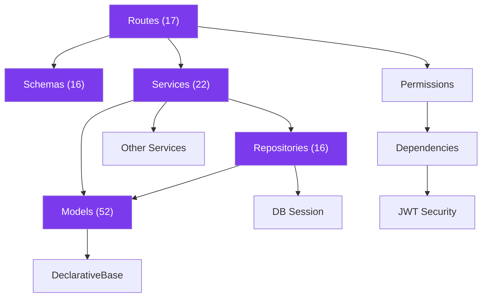
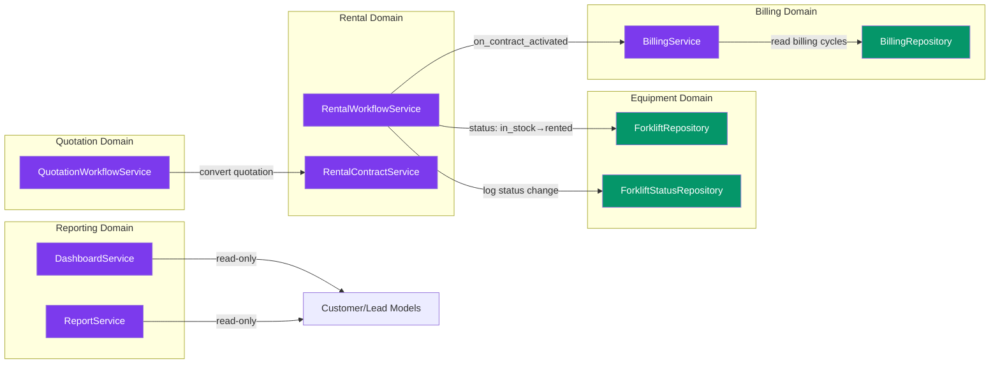

# Backend Architecture — Technical Design Specification

## 1. Technology Stack

| Component | Technology | Version |
|-----------|-----------|---------|
| Language | Python | 3.12+ |
| Framework | FastAPI | ≥0.115.0 |
| ASGI Server | Uvicorn (standard) | ≥0.32.0 |
| ORM | SQLAlchemy (asyncio) | ≥2.0.36 |
| Validation | Pydantic v2 + email | ≥2.10.0 |
| Settings | pydantic-settings | ≥2.6.0 |
| Auth | python-jose (HS256) + bcrypt | ≥3.3.0 / ≥4.0.0 |
| Migrations | Alembic | ≥1.14.0 |
| File Upload | python-multipart | ≥0.0.9 |
| Excel I/O | openpyxl | ≥3.1.0 |
| Dev DB Driver | aiosqlite | ≥0.17.0 |
| Prod DB Driver | asyncpg (commented out) | ≥0.31.0 |

## 2. Application Configuration

`app/core/config.py` — Pydantic BaseSettings with `.env` file support.

| Setting | Type | Default | Env Var |
|---------|------|---------|---------|
| `APP_NAME` | str | `"DK CRM API"` | `APP_NAME` |
| `APP_VERSION` | str | `"1.0.0"` | `APP_VERSION` |
| `DEBUG` | bool | `False` | `DEBUG` |
| `DATABASE_URL` | str | `sqlite+aiosqlite:///./crm.db` | `DATABASE_URL` |
| `SECRET_KEY` | str | `changeme-use-a-strong-secret-in-production` | `SECRET_KEY` |
| `ALGORITHM` | str | `HS256` | `ALGORITHM` |
| `ACCESS_TOKEN_EXPIRE_MINUTES` | int | `30` | `ACCESS_TOKEN_EXPIRE_MINUTES` |
| `REFRESH_TOKEN_EXPIRE_DAYS` | int | `7` | `REFRESH_TOKEN_EXPIRE_DAYS` |
| `UPLOAD_DIR` | str | `uploads/images` | `UPLOAD_DIR` |
| `MAX_UPLOAD_SIZE_MB` | int | `5` | `MAX_UPLOAD_SIZE_MB` |
| `ALLOWED_ORIGINS` | list[str] | 6 localhost entries | `ALLOWED_ORIGINS` |

Singleton: `settings = Settings()` at module level.

## 3. Layered Architecture

```
Request → Middleware → Route → Schema (validate) → Service (logic) → Repository (query) → Model (ORM) → Database
```

### 3.1 Layer Inventory

| Layer | Directory | File Count | Responsibility |
|-------|-----------|------------|----------------|
| Routes | `app/routes/` | 17 files + `catalog.py` aggregator | HTTP handlers, request/response, permission checks |
| Schemas | `app/schemas/` | 16 files | Pydantic Create/Update/Out DTOs, field validation |
| Services | `app/services/` | 22 files | Business logic, workflow state machines, cross-domain hooks |
| Repositories | `app/repositories/` | 16 files | Query building, eager loading, pagination, filtering |
| Models | `app/models/` | 52 files | SQLAlchemy table definitions, relationships, enums |
| Core | `app/core/` | 4 files | Config, security, permissions, middleware |
| Database | `app/database/` | 3 files | Engine, session factory, declarative base |
| Utils | `app/utils/` | 2 files | Export (CSV/Excel), slugify |

### 3.2 Import Rules



No circular imports exist. Cross-service calls are one-directional:
- `rental_workflow_service` → `billing_service` (contract activation triggers invoice)
- `rental_workflow_service` → `forklift_service` (status transitions)
- `quotation_workflow_service` → `rental_contract_service` (convert quotation)

## 4. Database Layer

### 4.1 Engine Configuration

`app/database/session.py`:

| Param | SQLite | PostgreSQL |
|-------|--------|------------|
| Pooling | `NullPool` | Default pool |
| `pool_pre_ping` | — | `True` |
| `pool_size` | — | `10` |
| `max_overflow` | — | `20` |
| `check_same_thread` | `False` | — |
| `echo` | `settings.DEBUG` | `settings.DEBUG` |

Session: `async_sessionmaker(engine, class_=AsyncSession, expire_on_commit=False)`

`get_db()` — async generator yielding session, rolls back on exception.

### 4.2 Declarative Base

`app/database/base.py`: `class Base(DeclarativeBase): pass` — plain SQLAlchemy 2.0, no mixins.

### 4.3 Migration Strategy

- **Development:** `Base.metadata.create_all` on startup + `_apply_sqlite_migrations()` for schema patches
- **Production:** Alembic async migrations via `alembic upgrade head`
- **Alembic env.py:** Imports `settings.DATABASE_URL`, imports `app.models` to register all tables, uses `async_engine_from_config` with `NullPool`

## 5. Middleware Stack

Registered in `main.py`:

| Order | Middleware | Source |
|-------|-----------|--------|
| 1 | `CORSMiddleware` | FastAPI built-in — `allow_origins=settings.ALLOWED_ORIGINS`, `allow_credentials=True`, `allow_methods=["*"]`, `allow_headers=["*"]` |

Defined but **not registered** (available for production hardening):

| Middleware | File | Function |
|-----------|------|----------|
| `SecurityHeadersMiddleware` | `core/middleware.py` | Injects 6 security headers: `X-Content-Type-Options: nosniff`, `X-Frame-Options: DENY`, `X-XSS-Protection: 1; mode=block`, `Referrer-Policy: strict-origin-when-cross-origin`, `Permissions-Policy: camera=(), microphone=(), geolocation=()`, `Cache-Control: no-store` |
| `RequestIdMiddleware` | `core/middleware.py` | Generates/propagates `X-Request-ID`, logs method + path + status + elapsed_ms |

### Refactor action: Register both middleware in `main.py` for production.

## 6. Application Lifecycle

`main.py` lifespan context manager:

```
Startup:
  1. Base.metadata.create_all (ensures all 56 tables exist)
  2. If SQLite: run _apply_sqlite_migrations (idempotent column adds, enum normalization)
  3. RBACService.seed_roles() — creates 4 default roles if missing

Shutdown:
  4. engine.dispose()
```

## 7. Router Registration

All routers registered with `prefix="/api/v1"` in this order:

| # | Module | Router | Prefix |
|---|--------|--------|--------|
| 1 | auth | `auth.router` | `/api/v1/auth` |
| 2 | users | `users.router` | `/api/v1/users` |
| 3 | customers | `customers.router` | `/api/v1/customers` |
| 4 | leads | `leads.router` | `/api/v1/leads` |
| 5 | dashboard | `dashboard.router` | `/api/v1/dashboard` |
| 6 | activity | `activity.router` | `/api/v1/activity-logs` |
| 7 | roles | `roles.router` | `/api/v1/roles` |
| 8 | reports | `reports.router` | `/api/v1/reports` |
| 9 | catalog | `catalog_router` | `/api/v1/catalog` |
| 10 | forklifts | `forklifts.router` | `/api/v1/forklifts` |
| 11 | quotations | `quotations.router` | `/api/v1/quotations` |
| 12 | rentals | `rentals.router` | `/api/v1/rental-contracts` |
| 13 | movements | `movements.router` | `/api/v1/movements` |
| 14 | maintenance | `maintenance.router` | `/api/v1/maintenance` |
| 15 | inventory | `inventory.router` | `/api/v1/inventory` |
| 16 | billing | `billing.router` | `/api/v1/billing` |
| 17 | uploads | `uploads.router` | `/api/v1/uploads` |

Catalog aggregator (`routes/catalog.py`) sub-mounts: import → products → brands → categories.

## 8. Exception Handling

| Handler | Status | Response |
|---------|--------|----------|
| `RequestValidationError` | 422 | `{detail: [...errors], error_id: "hex12"}` |
| Generic `Exception` | 500 | `{detail: "An internal error occurred...", error_id: "hex12"}` |

Both generate a unique 12-character hex `error_id` and log the full error with that ID.

## 9. Static File Serving

```python
StaticFiles(directory="uploads") mounted at "/uploads"
```

Upload directory: `settings.UPLOAD_DIR` (`uploads/images`), created on startup with `mkdir(parents=True, exist_ok=True)`.

URL pattern: `/uploads/images/{uuid_hex}.{ext}`

## 10. Health Endpoint

`GET /health` — checks database connectivity via `SELECT 1`.

Response: `{status: "healthy"|"degraded", version: "1.0.0", database: "ok"|"unreachable"}`

## 11. Cross-Service Dependencies



## 12. Refactor Impact on Backend Architecture

Per the refactor plan, the following backend changes are required:

| Phase | Backend Changes |
|-------|----------------|
| Phase 1 | Fix dead code (brand_service.py, product_service.py), add brand pagination endpoint |
| Phase 4 | Fix hardcoded `monthly_rate / 30` divisor in rental_contract_service.py |
| Phase 6 | Fix `days = months * 30` approximation in maintenance_service.py |
| Phase 9 | **NEW:** `profitability_service.py`, `routes/profitability.py`, `schemas/profitability.py` |
| Phase 10 | **NEW:** `executive_service.py`, `routes/executive.py`, `schemas/executive.py` |
| C4 | No backend changes (permission-aware UI is frontend-only) |
| C5 | Add password change endpoint if missing |
