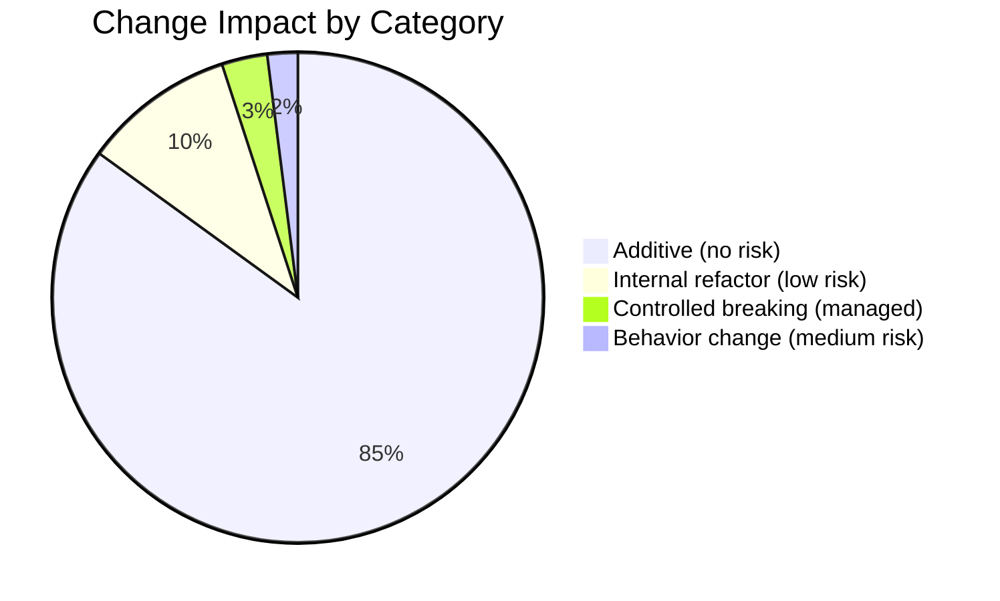

# Compatibility Report — Technical Design Specification

### Compatibility at a Glance



## 1. API Backward Compatibility

### Unchanged Endpoints (218 existing)

All existing API endpoints retain their:
- URL paths
- HTTP methods
- Request body schemas
- Response body schemas (except brands, see below)
- Query parameter names and types
- Permission requirements

**No client-facing API breaking changes** unless explicitly noted below.

### One Controlled Breaking Change

| Endpoint | Current Response | New Response | Phase |
|----------|-----------------|-------------|-------|
| `GET /api/v1/catalog/brands` | `list[BrandOut]` | `{items: list[BrandOut], total, page, page_size, pages}` | 1.4 |

**Impact:** Frontend `api/catalog.ts` is the only consumer. Updated simultaneously. No external API consumers exist.

**Mitigation:** If external consumers are added before Phase 1.4, add a `format` query param: `?format=list` for backward compat.

### New Endpoints (7 additions)

| Endpoint | Phase | Permission |
|----------|-------|-----------|
| `GET /api/v1/profitability/fleet` | 9 | PROFITABILITY_READ |
| `GET /api/v1/profitability/assets/{id}` | 9 | PROFITABILITY_READ |
| `GET /api/v1/profitability/contracts/{id}` | 9 | PROFITABILITY_READ |
| `GET /api/v1/profitability/summary` | 9 | PROFITABILITY_READ |
| `GET /api/v1/executive/summary` | 10 | VIEW_DASHBOARD |
| `GET /api/v1/executive/kpis` | 10 | VIEW_DASHBOARD |
| `POST /api/v1/executive/kpi-targets` | 10 | MANAGE_USERS |

New endpoints do not conflict with any existing route prefixes.

## 2. Database Compatibility

### Schema Compatibility

| Aspect | Compatibility |
|--------|--------------|
| Existing 56 tables | **No schema changes** |
| Column types | Unchanged |
| Foreign keys | Unchanged |
| Indexes | Unchanged (new indexes may be added) |
| Constraints | Unchanged |
| Enum values | Unchanged |
| Data | No migration of existing data |

### New Tables (Phase 9-10, optional)

| Table | Purpose | Impact on Existing |
|-------|---------|-------------------|
| `kpi_targets` | Store KPI target values | None — no FK references from existing tables |

### SQLite → PostgreSQL Compatibility

All SQLAlchemy models use portable types. Known SQLite-specific code:

| File | SQLite-Specific Code | PostgreSQL Equivalent |
|------|---------------------|----------------------|
| `main.py:34-106` | `_apply_sqlite_migrations()` with `PRAGMA` and table rebuild | Alembic migrations handle this |
| `database/session.py` | `check_same_thread=False`, `NullPool` | Standard pool with `pool_pre_ping=True` |

Alembic is configured for both. No manual SQL queries use SQLite-specific syntax in service/repository layers.

## 3. Frontend Compatibility

### Browser Support

| Browser | Minimum Version | Reason |
|---------|----------------|--------|
| Chrome | 91+ | ES2023 target, CSS custom properties |
| Firefox | 90+ | CSS custom properties, :has() not required |
| Safari | 15+ | ES2023, CSS gap |
| Edge | 91+ | Chromium-based |

No changes to browser support requirements from the refactor.

### Route Compatibility

| Change | Backward Compatible | Notes |
|--------|-------------------|-------|
| New routes (8) | Yes | Additive only |
| Existing routes (47) | All preserved | No path changes |
| Placeholder replacements (3) | Yes | Same paths, better content |
| Catch-all redirect | Preserved | `* → /dashboard` |

### State Management Compatibility

| Store | Changes | Backward Compatible |
|-------|---------|-------------------|
| authStore | No changes | Yes |
| sidebarStore | No changes (C4 reads store, doesn't change shape) | Yes |
| themeStore | No changes | Yes |
| toastStore | No changes | Yes |

### CSS Compatibility

| Change | Impact |
|--------|--------|
| New `detail-layout.css` | Additive — no existing class names change |
| `ProductDetailPage.css` reduced | Classes moved, not renamed — pages import new file instead |
| `tokens.css` | No changes to token names |
| `shared.css` | No changes |

### TypeScript Compatibility

| Change | Impact |
|--------|--------|
| New `types/common.ts` | Additive — existing type names preserved |
| New `types/profitability.ts` | Additive |
| Removed duplicates in quotation/rental/movement/billing types | Re-exports from common.ts maintain import paths |

## 4. Permission Compatibility

### Existing Permissions (28)

All 28 existing permissions retain their names, values, and role mappings. No permission is removed or renamed.

### New Permission (1)

| Permission | Value | Granted To |
|-----------|-------|-----------|
| `PROFITABILITY_READ` | `profitability.read` | super_admin, manager |

**Impact:** `frozenset(PermissionName)` for SUPER_ADMIN automatically includes new permissions. Manager role needs explicit addition to its frozenset.

### Role Behavior

| Role | Change |
|------|--------|
| super_admin | Automatically gets all new permissions |
| manager | Must explicitly add PROFITABILITY_READ |
| sales | No changes — cannot access profitability |
| support | No changes — cannot access profitability |

## 5. Deployment Compatibility

### Docker Compose

No changes to `docker-compose.yml` structure. Container names, ports, volumes, networks all preserved.

**Recommended addition (non-breaking):**
```yaml
# Add upload volume to backend service
volumes:
  - uploads:/app/uploads
```

### Environment Variables

| Variable | Change |
|----------|--------|
| All existing | Unchanged |
| None new required | Profitability and executive features use existing DB |

### Nginx Configuration

No changes to `nginx.conf`. New API routes (`/api/v1/profitability/*`, `/api/v1/executive/*`) are automatically proxied by the existing `/api/` location block.

## 6. Third-Party Dependency Compatibility

### Backend Dependencies

No new Python packages required for phases 1-8.

| Phase | New Dependency | Purpose |
|-------|---------------|---------|
| 6 | `python-dateutil` (optional) | `relativedelta` for month calculation — can also use stdlib |
| 10 | None for MVP | PDF export deferred |

### Frontend Dependencies

No new npm packages required for any phase.

| Existing Package | Version | Used By | Change |
|-----------------|---------|---------|--------|
| react | 19.2.6 | All phases | None |
| react-router-dom | 7.17.0 | New routes | None |
| zustand | 5.0.14 | C4 (reads store) | None |
| axios | 1.18.0 | New API clients | None |
| recharts | 3.8.1 | Phase 9, 10 charts | None |
| lucide-react | 1.18.0 | New page icons | None |

## 7. Data Compatibility

### Existing Data

| Concern | Status |
|---------|--------|
| Customer records | Unaffected |
| Lead records | Unaffected |
| Forklift records | Unaffected |
| Quotations | Unaffected |
| Rental contracts | Unaffected |
| Invoices | Unaffected |
| Payments | Unaffected |

### Calculation Changes

| Change | Affected Data | Impact |
|--------|--------------|--------|
| Rate divisor fix (Phase 4) | **New** contract line totals only | Existing invoices are unaffected — amounts already stored |
| Month approximation fix (Phase 6) | **Future** schedule recurrence dates | Existing next_due_date values recalculate on next service verification |

No existing stored data is modified by any phase.

## 8. Compatibility Summary

| Dimension | Verdict |
|-----------|---------|
| API URLs | ✅ 100% compatible (1 managed internal change) |
| Database schema | ✅ No existing table changes |
| Database data | ✅ No data migration |
| Frontend routes | ✅ All existing routes preserved |
| State management | ✅ No store shape changes |
| CSS class names | ✅ No renames, only file reorganization |
| TypeScript types | ✅ No renames, additive only |
| Permissions | ✅ No removals, 1 addition |
| Docker deployment | ✅ No breaking config changes |
| Dependencies | ✅ No new required dependencies |
| Browser support | ✅ No changes |
