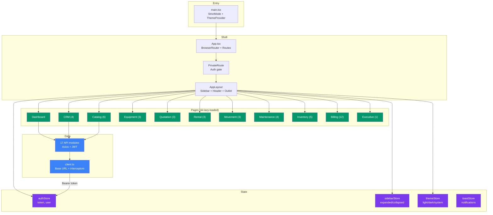

# Frontend Architecture — Technical Design Specification

### Application Architecture Overview



## 1. Technology Stack

| Component | Technology | Version |
|-----------|-----------|---------|
| UI Framework | React | 19.2.6 |
| Language | TypeScript | 6.0.2 |
| Build Tool | Vite | 8.0.12 |
| Routing | react-router-dom | 7.17.0 |
| State Management | Zustand | 5.0.14 |
| HTTP Client | Axios | 1.18.0 |
| Charts | Recharts | 3.8.1 |
| Icons | Lucide React | 1.18.0 |
| Linting | ESLint | 10.3.0 |

## 2. Build Configuration

### Vite Config

| Setting | Value |
|---------|-------|
| Dev Server Port | 5173 |
| API Proxy | `/api` → `http://localhost:8000` (changeOrigin: true) |
| Path Alias | `@` → `./src` |
| Manual Chunks | `vendor-react` (react, react-dom, react-router), `vendor-charts` (recharts, d3-*) |

### TypeScript Config

| Setting | Value |
|---------|-------|
| Target | ES2023 |
| Module | ESNext |
| Module Resolution | Bundler |
| JSX | react-jsx |
| Strict | true |
| noUnusedLocals | true |
| noUnusedParameters | true |

## 3. Entry Point

`main.tsx` wraps `<App />` in `<StrictMode>` and `<ThemeProvider>`.

Global CSS imports (in order):
1. `index.css` (imports `tokens.css` and `breakpoints.css`)
2. `shared.css`
3. `marketplace.css`

## 4. Application Shell

### AppLayout Structure

```
<Sidebar />
<div class="app-main">
  <Header />
  <main>
    <Outlet />  ← page content renders here
  </main>
</div>
```

- Sidebar width driven by CSS variable `--sidebar-width`
- Responsive breakpoints: hidden ≤768px, collapsed ≤1024px, user preference at wider
- `<PrivateRoute>` wraps all authenticated routes (redirects to `/login` if no token)

### Sidebar Navigation Groups

| # | Group ID | Label | Items |
|---|----------|-------|-------|
| 1 | `dashboard` | Dashboard | Overview |
| 2 | `crm` | CRM | Customers, Leads, Quotations |
| 3 | `equipment` | Equipment | Registry, Movements |
| 4 | `rental` | Rental | Contracts |
| 5 | `maintenance` | Maintenance | Dashboard |
| 6 | `inventory` | Inventory | Dashboard, Products |
| 7 | `finance` | Finance | Dashboard, Invoices, Payments, Deposits, Statements |
| 8 | `executive` | Executive BI | Activity, Reports, Analytics |

Settings link appears below a divider, outside groups.

## 5. Routing

### All Routes (47 paths)

| Path | Page Component | Status |
|------|---------------|--------|
| `/login` | LoginPage | Active |
| `/dashboard` | DashboardPage | Active |
| `/customers` | CustomersPage | Active |
| `/leads` | LeadsPage | Active |
| `/activity` | ActivityPage | Active |
| `/reports` | ReportsPage | Active |
| `/settings` | **Placeholder** | Stub |
| `/catalog` | CatalogPage | Active |
| `/catalog/products/:id` | ProductDetailPage | Active |
| `/catalog/brands` | BrandsPage | Active |
| `/catalog/categories` | CategoriesPage | Active |
| `/catalog/import` | ImportPage | Active |
| `/equipment` | EquipmentRegistryPage | Active |
| `/equipment/:id` | ForkliftDetailPage | Active |
| `/quotations` | QuotationListPage | Active |
| `/quotations/new` | QuotationFormPage | Active |
| `/quotations/:id` | QuotationDetailPage | Active |
| `/rental-contracts` | RentalContractListPage | Active |
| `/rental-contracts/new` | RentalContractFormPage | Active |
| `/rental-contracts/:id` | RentalContractDetailPage | Active |
| `/movements` | MovementListPage | Active |
| `/movements/new` | MovementForm | Active |
| `/movements/:id` | MovementDetailPage | Active |
| `/billing` | BillingDashboardPage | Active |
| `/billing/invoices` | InvoiceListPage | Active |
| `/billing/invoices/:id` | InvoiceDetailPage | Active |
| `/billing/payments` | PaymentListPage | Active |
| `/billing/payments/:id` | PaymentDetailPage | Active |
| `/billing/deposits` | DepositListPage | Active |
| `/billing/deposits/:id` | DepositDetailPage | Active |
| `/billing/revenue-recognitions` | RevenueRecognitionPage | Active |
| `/billing/finance` | FinanceDashboardPage | Active |
| `/billing/payments-unified` | PaymentPage | Active |
| `/billing/deposits-unified` | DepositPage | Active |
| `/billing/statements` | StatementPage | Active |
| `/maintenance` | MaintenanceDashboardPage | Active |
| `/maintenance/work-orders` | WorkOrderListPage | Active |
| `/maintenance/work-orders/new` | **Placeholder** | Stub |
| `/maintenance/work-orders/:id` | WorkOrderDetailPage | Active |
| `/maintenance/schedules` | MaintenanceSchedulePage | Active |
| `/inventory` | InventoryDashboardPage | Active |
| `/inventory/parts` | SparePartListPage | Active |
| `/inventory/parts/new` | **Placeholder** | Stub |
| `/inventory/parts/:id` | SparePartDetailPage | Active |
| `/inventory/warehouses` | WarehousePage | Active |
| `/inventory/purchase-orders` | PurchaseOrderPage | Active |
| `/executive` | ExecutiveDashboardPage | Active |
| `*` | → `/dashboard` | Redirect |

44 lazy-loaded pages, 3 placeholder stubs.

### Routes to Add (per refactor plan)

| Route | Component | Phase |
|-------|-----------|-------|
| `/quotations/:id/edit` | QuotationFormPage (edit mode) | Phase 3 |
| `/rental-contracts/:id/edit` | RentalContractFormPage (edit mode) | Phase 4 |
| `/movements/:id/edit` | MovementForm (edit mode) | Phase 5 |
| `/maintenance/work-orders/:id/edit` | WorkOrderFormPage (edit mode) | Phase 6 |
| `/inventory/parts/:id/edit` | SparePartFormPage (edit mode) | Phase 7 |
| `/profitability` | ProfitabilityDashboardPage | Phase 9 |
| `/profitability/assets/:id` | AssetProfitabilityPage | Phase 9 |
| `/profitability/contracts/:id` | ContractProfitabilityPage | Phase 9 |

## 6. State Management (Zustand Stores)

### authStore

```typescript
{
  token: string | null,
  refreshToken: string | null,
  user: User | null,
  setToken(token), setRefreshToken(token), setUser(user),
  logout(),
  isAuthenticated(): boolean
}
```

Persists `token` and `refreshToken` to `localStorage`.

### sidebarStore

```typescript
{
  state: 'expanded' | 'collapsed' | 'hidden',
  collapsedGroups: string[],
  hoverExpanded: boolean,
  setState(state), toggle(), toggleGroup(id), setHoverExpanded(val)
}
```

Persists to `localStorage`. Responsive breakpoint logic on mount.

### themeStore

```typescript
{
  mode: 'light' | 'dark' | 'system',
  resolved: 'light' | 'dark',
  setMode(mode), setResolved(theme)
}
```

`localStorage` key: `dk-theme`. ThemeProvider sets `data-theme` attribute on `<html>`.

### toastStore

```typescript
{
  toasts: Toast[],
  add(toast), remove(id)
}
// Toast = { id, type: 'success'|'error'|'info', message }
// Auto-dismiss: 4 seconds
// Helpers: toast.success(msg), toast.error(msg), toast.info(msg)
```

## 7. API Client

`api/client.ts` — Axios instance.

| Config | Value |
|--------|-------|
| Base URL | `VITE_API_BASE_URL` env var |
| Request interceptor | Attaches `Authorization: Bearer <token>` from localStorage |
| Response interceptor | On 401 or 403 "Not authenticated": clears auth, redirects to `/login` (skips `/auth/` endpoints and role-based 403s) |

### API Module Files (17)

| File | Domain | Functions |
|------|--------|-----------|
| `api/auth.ts` | Auth | login, register, refresh, logout |
| `api/users.ts` | Users | list, get, create, update, delete |
| `api/customers.ts` | CRM | list, get, create, update, delete |
| `api/leads.ts` | CRM | list, get, create, update, delete, notes |
| `api/dashboard.ts` | Dashboard | getSummary, getLeadTrend, getCustomerTrend |
| `api/reports.ts` | Reports | downloadReport |
| `api/catalog.ts` | Catalog | products, brands, categories, import (30+ functions) |
| `api/forklift.ts` | Equipment | list, get, create, update, delete (5 functions only — sub-entities missing) |
| `api/quotation.ts` | Quotation | CRUD + workflow actions |
| `api/rental.ts` | Rental | CRUD + workflow + extensions + returns + damage + billing |
| `api/movement.ts` | Movement | CRUD + workflow + checkpoint |
| `api/maintenance.ts` | Maintenance | dashboard, plans, schedules, work orders, costs, history |
| `api/inventory.ts` | Inventory | dashboard, parts, warehouses, balances, transactions, POs, consume |
| `api/billing.ts` | Billing | invoices, payments, deposits, revenue recognition, summary |
| `api/upload.ts` | Uploads | uploadImage |
| `api/activity.ts` | Activity | list, listMine, getByEntity |
| `api/client.ts` | Core | Axios instance |

## 8. CSS Architecture

### Style Layers

| Layer | File(s) | Purpose |
|-------|---------|---------|
| Design Tokens | `styles/tokens.css` | CSS custom properties (colors, spacing, radius, shadows) — light + `[data-theme="dark"]` |
| Breakpoints | `styles/breakpoints.css` | Responsive media query variables |
| Shared Patterns | `styles/shared.css` | `.page-header`, `.toolbar`, `.table-card`, `.data-table`, `.pagination`, `.page-error` |
| Detail Patterns | `styles/detail.css` | `.detail-header`, `.detail-title-row`, `.detail-badges`, `.detail-section` |
| Marketplace | `styles/marketplace.css` | Product catalog grid layout |
| Page CSS | `pages/*/PageName.css` | 13 page-specific CSS files |
| Component CSS | `components/*/Component.css` | Per-component styles |

### Cross-Module CSS Problem

5 pages import `@/pages/Catalog/ProductDetailPage.css` from outside their module:

| Importer | Line |
|----------|------|
| `QuotationDetailPage.tsx` | 18 |
| `RentalContractDetailPage.tsx` | 19 |
| `MovementDetailPage.tsx` | 16 |
| `WorkOrderDetailPage.tsx` | 9 |
| `SparePartDetailPage.tsx` | 7 |

**Resolution (C1):** Extract shared classes to `styles/detail-layout.css`.

### Inline Styles

491 `style={{...}}` occurrences across 45 page files. Highest concentration:
- `CatalogPage.tsx` — 32
- `DepositDetailPage.tsx` — 35
- `EquipmentRegistryPage.tsx` — 25
- `ActivityPage.tsx` — 25
- `ExecutiveDashboardPage.tsx` — 23

## 9. Component Inventory

| Category | Directory | Count | Examples |
|----------|-----------|-------|---------|
| Layout | `components/layout/` | 4 | AppLayout, Sidebar, Header, Breadcrumb |
| UI | `components/ui/` | 14 | Modal, Toast, Badge, ImageUpload, Pagination |
| Charts | `components/charts/` | 4 | Recharts wrappers |
| Billing | `components/billing/` | 9 | Invoice/payment/deposit components |
| Catalog | `components/catalog/` | 5 | Product card, import wizard |
| Equipment | `components/equipment/` | 5 | Forklift card, status badge |
| Inventory | `components/inventory/` | 3 | Part card, stock badge |
| Maintenance | `components/maintenance/` | 3 | Work order card, schedule |
| Movement | `components/movement/` | 3 | Movement card, timeline |
| Quotation | `components/quotation/` | 1 | Status badge |
| Rental | `components/rental/` | 1 | Status badge |

## 10. Type System

12 TypeScript type files in `src/types/`:

| File | Key Types |
|------|-----------|
| `auth.ts` | User, LoginRequest, TokenResponse |
| `customer.ts` | Customer, CustomerCreate |
| `lead.ts` | Lead, LeadNote, LeadCreate |
| `dashboard.ts` | DashboardSummary, TrendPoint |
| `catalog.ts` | Product, Brand, Category, ImportJob |
| `forklift.ts` | Forklift, ForkliftDetail, ForkliftSpec, ForkliftCreate |
| `quotation.ts` | Quotation, QuotationDetail, QuotationItem |
| `rental.ts` | RentalContract, RentalContractDetail, RentalExtension, RentalReturn |
| `movement.ts` | Movement, MovementDetail, MovementHistory |
| `maintenance.ts` | WorkOrder, MaintenancePlan, Schedule |
| `inventory.ts` | SparePart, InventoryBalance, PurchaseOrder |
| `billing.ts` | Invoice, Payment, Deposit, RevenueRecognition |

### Duplicated Interfaces (to extract per C2)

`CustomerBrief`, `UserBrief`, `ForkliftBrief` defined identically in `quotation.ts`, `rental.ts`, `movement.ts`, `billing.ts`.
