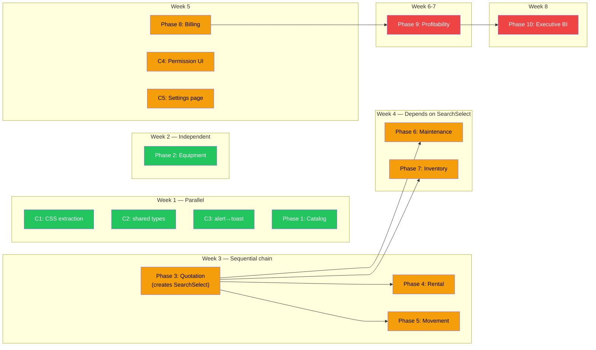

# Impact Analysis — Technical Design Specification

## 1. Summary of Changes

| Category | Count |
|----------|-------|
| New files to create | 12 |
| Existing files to modify | 38 |
| Backend files affected | 8 |
| Frontend files affected | 30+ |
| New frontend routes | 8 |
| Placeholder routes to replace | 3 |
| Cross-module CSS imports to remove | 5 |
| Hardcoded values to extract | 8 |
| Dead code to remove | 4 instances |
| `alert()` calls to replace | 3 |
| New API endpoints to add | 7 |
| New DB tables (optional) | 1-2 |

## 2. Per-Phase Impact Analysis

### Cross-Cutting (C1–C5)

| Item | Files Modified | Files Created | Risk | Users Affected |
|------|---------------|---------------|------|---------------|
| C1: CSS extraction | 6 frontend pages + 1 new CSS file | `styles/detail-layout.css` | LOW — visual regression possible | All detail page users |
| C2: Shared types | 4 type files + all importers | `types/common.ts` | LOW — type-only change | None (compile-time) |
| C3: alert→toast | 2 frontend pages | None | NONE | Billing users (error display improves) |
| C4: Permission UI | Sidebar.tsx + 20+ pages with action buttons | `components/ui/Can.tsx` | MEDIUM — could hide needed buttons | All users, especially support/sales |
| C5: Settings page | App.tsx (1 route change) | `pages/Settings/SettingsPage.tsx` | LOW — new page, no existing behavior changes | All users (gain password change) |

### Phase 1 — Catalog Hardening

| Change | Files | Impact Radius | Breaking? |
|--------|-------|--------------|-----------|
| Fix description_en in edit | ProductForm.tsx | Catalog editors only | No |
| Fix useState→useEffect | BrandsPage.tsx, CategoriesPage.tsx | Catalog modal users | No |
| Build spec/image/compat UI | ProductDetailPage.tsx | Product detail view | No (additive) |
| Add brand pagination | routes/brands.py, brand_repository.py, schemas/brand.py, BrandsPage.tsx | Brand API consumers | **Yes** — response shape changes from `list[]` to `{items, total, page}` |
| Remove dead code | brand_service.py, product_service.py | None — unused code | No |

**Breaking change mitigation (1.4):** Frontend is the only consumer. Update frontend caller simultaneously.

### Phase 2 — Equipment

| Change | Files | Impact Radius | Breaking? |
|--------|-------|--------------|-----------|
| Build spec form | ForkliftDetailPage.tsx, api/forklift.ts | Equipment detail view | No (additive) |
| Build 6 sub-entity tabs | ForkliftDetailPage.tsx, api/forklift.ts | Equipment detail view | No (additive) |
| Fix edit mode | ForkliftForm.tsx | Equipment editors | No (fix) |
| Remove hardcoded thresholds | ForkliftDetailPage.tsx, EquipmentRegistryPage.tsx | PM threshold display | No |

**No breaking changes.** All changes are additive or fix existing bugs.

### Phase 3 — Quotation

| Change | Files | Impact Radius | Breaking? |
|--------|-------|--------------|-----------|
| Add form fields | QuotationFormPage.tsx | Quotation creators | No (additive) |
| Build edit page | QuotationFormPage.tsx, App.tsx | New route `/quotations/:id/edit` | No (new route) |
| SearchSelect component | New shared component | Used across phases 3-7 | No (new) |
| Date range filter | QuotationListPage.tsx | Quotation list view | No (additive) |

### Phase 4 — Rental

| Change | Files | Impact Radius | Breaking? |
|--------|-------|--------------|-----------|
| Add form fields | RentalContractFormPage.tsx | Contract creators | No |
| Wire billing generation | RentalContractDetailPage.tsx | Active contract users | No (replaces stub) |
| Build return flow UI | RentalContractDetailPage.tsx | Return processors | No (additive) |
| Fix rate divisor | rental_contract_service.py | **All contract calculations** | **Potential** — changes line totals |

**Rate divisor risk:** Changing `monthly_rate / 30` to calendar-based calculation will produce different line totals for contracts spanning months with ≠30 days. Existing invoices are unaffected (amounts already stored). New calculations will be more accurate but different from historical ones.

### Phase 5 — Movement

| Change | Files | Impact Radius | Breaking? |
|--------|-------|--------------|-----------|
| Add form fields | MovementForm.tsx | Movement creators | No |
| Build checkpoint UI | MovementDetailPage.tsx | Movement trackers | No (additive) |
| Fix grid pagination | MovementListPage.tsx | Movement list users | No (fix) |

### Phase 6 — Maintenance

| Change | Files | Impact Radius | Breaking? |
|--------|-------|--------------|-----------|
| **Build WO form** | New: WorkOrderFormPage.tsx, App.tsx | Maintenance users | No (replaces placeholder) |
| Build edit capability | WorkOrderFormPage.tsx, WorkOrderDetailPage.tsx | WO editors | No (additive) |
| Fix month calculation | maintenance_service.py | **PM schedule recurrence** | **Potential** — changes next_due_date |

**Month calculation risk:** Changing `days = months * 30` to `relativedelta` will shift future schedule dates by 0-3 days depending on month length. Existing schedules will recalculate on next service verification.

### Phase 7 — Inventory

| Change | Files | Impact Radius | Breaking? |
|--------|-------|--------------|-----------|
| **Build Spare Part form** | New: SparePartFormPage.tsx, App.tsx | Inventory users | No (replaces placeholder) |
| Build edit capability | SparePartFormPage.tsx, SparePartDetailPage.tsx | Part editors | No (additive) |
| Add PO create button | PurchaseOrderPage.tsx | PO creators | No (additive) |

### Phase 8 — Billing

| Change | Files | Impact Radius | Breaking? |
|--------|-------|--------------|-----------|
| Add create buttons | InvoiceListPage, PaymentListPage, DepositListPage | Billing creators | No (additive) |
| Replace alert→toast | DepositDetailPage.tsx, RevenueRecognitionPage.tsx | Error display | No |
| Replace raw modal | DepositDetailPage.tsx | Deposit detail UX | No |
| Wire updateInvoice | InvoiceDetailPage.tsx | Invoice editors | No (additive) |

### Phase 9 — Profitability

| Change | Files | Impact Radius | Breaking? |
|--------|-------|--------------|-----------|
| New backend service | profitability_service.py | New domain | No |
| New API endpoints | routes/profitability.py | New routes | No |
| New permission | permissions.py, ROLE_PERMISSIONS | Permission matrix | **Yes** — adds PROFITABILITY_READ |
| New frontend pages | 3 new pages | New navigation | No |
| Sidebar update | Sidebar.tsx | Navigation | No |

**Permission impact:** Adding `PROFITABILITY_READ` to PermissionName and granting it to manager + super_admin. No existing permissions change.

### Phase 10 — Executive BI

| Change | Files | Impact Radius | Breaking? |
|--------|-------|--------------|-----------|
| New backend service | executive_service.py | New domain | No |
| New API endpoints | routes/executive.py | New routes | No |
| Refactor dashboard page | ExecutiveDashboardPage.tsx | Executive BI users | **Yes** — page behavior changes |
| Sidebar remains same | No change | None | No |

## 3. Dependency Graph for Changes

## 4. Risk Matrix

| Risk | Probability | Impact | Mitigation |
|------|------------|--------|-----------|
| CSS extraction breaks layout | Medium | Medium | Visual comparison of all 6 affected pages before/after |
| Permission UI locks out users | Medium | High | Test all 4 roles in dev environment before deploy |
| Rate divisor changes affect billing | Low | High | Only applies to new contracts, existing invoices unaffected |
| Brand pagination breaks consumers | Low | Low | Frontend is only consumer, updated simultaneously |
| Month approximation shifts schedules | Low | Medium | Schedules recalculate — communicate to users |
| SearchSelect performance on large datasets | Low | Medium | Debounced search (300ms), min 2 chars, limit results to 20 |
| Profitability calculations incorrect | Medium | High | Cross-reference with DK LAO Excel workbook totals |
| Executive API aggregation slow | Medium | Medium | Add composite indexes, cache results |

## 5. Test Coverage Impact

Current test coverage: **0%**. No tests exist.

Every phase introduces UI changes that should be verified manually. The refactor plan recommends building a test suite in parallel (2 weeks estimated).

| Layer | Recommended Tests | Tool |
|-------|------------------|------|
| Backend API | 50+ endpoint tests | pytest + httpx |
| Backend services | 30+ unit tests | pytest |
| Frontend components | 20+ component tests | vitest + React Testing Library |
| E2E workflows | 5+ critical path tests | Playwright |
