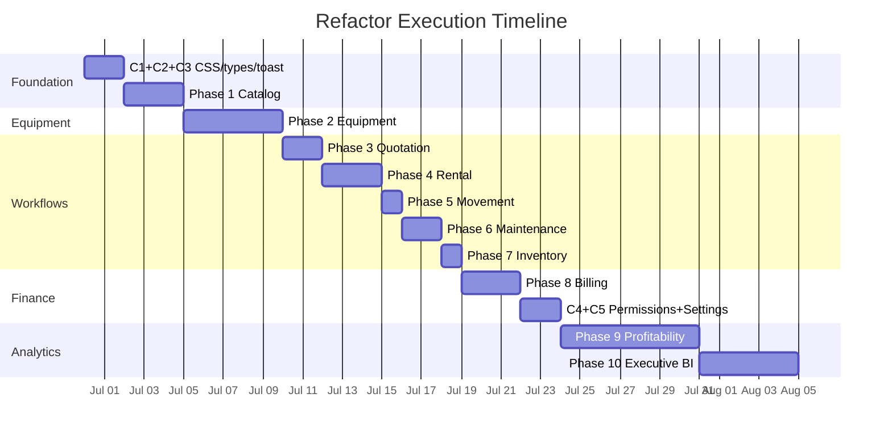
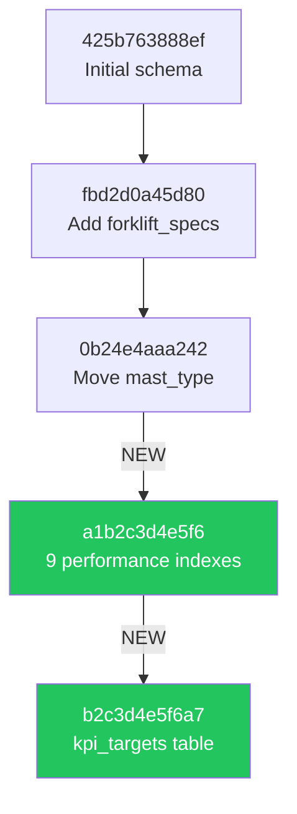

# Migration Plan — Technical Design Specification

> **Database artifacts:** Alembic migration scripts are in `docs/database/migration-001-performance-indexes.py` and `docs/database/migration-002-kpi-targets.py`. Full PostgreSQL DDL is in `docs/database/postgresql-schema.sql`.

## 1. Overview

This plan covers the execution sequence for all refactor phases, including data migration, schema changes, and deployment steps.

**Constraint:** All existing API URLs remain unchanged. No breaking changes to existing API contracts except brand pagination (Phase 1.4, managed internally).

### Timeline Overview



## 2. Pre-Migration Checklist

| # | Item | Action | Status |
|---|------|--------|--------|
| 1 | Create refactor branch | `git checkout -b refactor/v2-hardening` | Required |
| 2 | Backup SQLite database | `cp backend/crm.db backend/crm.db.backup` | Required |
| 3 | Verify backend starts | `uvicorn app.main:app` — no errors | Required |
| 4 | Verify frontend builds | `cd frontend && npm run build` — 0 TypeScript errors | Required |
| 5 | Document current endpoint count | `grep -c "@router" backend/app/routes/*.py` → 218 | Reference |
| 6 | Tag current state | `git tag v1.0-pre-refactor` | Required |

## 3. Phase Execution Order

### Week 1: Foundation + Catalog

#### Day 1-2: Cross-Cutting C1 + C2 + C3

**C1: CSS Extraction**

```bash
# Step 1: Create new shared CSS file
# Copy reusable classes from ProductDetailPage.css to styles/detail-layout.css

# Step 2: Update all 6 importers
# QuotationDetailPage.tsx:18    → import '@/styles/detail-layout.css'
# RentalContractDetailPage.tsx:19 → import '@/styles/detail-layout.css'
# MovementDetailPage.tsx:16     → import '@/styles/detail-layout.css'
# WorkOrderDetailPage.tsx:9     → import '@/styles/detail-layout.css'
# SparePartDetailPage.tsx:7     → import '@/styles/detail-layout.css'
# ProductDetailPage.tsx:8       → import './ProductDetailPage.css' (keep, but reduce to page-specific only)

# Step 3: Verify
# grep -r "ProductDetailPage.css" frontend/src/ → should return only ProductDetailPage.tsx
```

**C2: Extract Shared Types**

```bash
# Step 1: Create types/common.ts with CustomerBrief, UserBrief, ForkliftBrief
# Step 2: Update quotation.ts, rental.ts, movement.ts, billing.ts imports
# Step 3: Verify: npm run build → 0 errors
```

**C3: Replace alert() with toast**

```bash
# DepositDetailPage.tsx lines 46, 60 → toast.error(msg)
# RevenueRecognitionPage.tsx line 58  → toast.error(msg)
```

**Commit:** `refactor: extract shared CSS + types, replace alert with toast (C1+C2+C3)`

#### Day 3-5: Phase 1 — Catalog Hardening

```
Step 1: Fix ProductForm.tsx edit mode (1.1)
Step 2: Fix BrandsPage.tsx + CategoriesPage.tsx useState→useEffect (1.2)
Step 3: Build spec/image/compat tabs on ProductDetailPage.tsx (1.3)
Step 4: Add brand pagination — backend + frontend simultaneously (1.4)
Step 5: Remove dead code (1.5, 1.6)
```

**Verification:**
```bash
# Backend
uvicorn app.main:app  # starts without error
# curl http://localhost:8000/api/v1/catalog/brands?page=1&page_size=10

# Frontend
npm run build  # 0 TypeScript errors
# Manual: Open product detail, verify spec/image/compat tabs
# Manual: Open brands page, verify pagination
```

**Commit:** `feat: harden product catalog — edit fix, pagination, spec UI (Phase 1)`

### Week 2: Equipment

#### Day 1-3: Phase 2.1 + 2.2 — Sub-entity Tabs

```
Step 1: Add 18 API functions to api/forklift.ts
Step 2: Build spec management tab (add/edit/delete specs)
Step 3: Build photo gallery tab (upload via ImageUpload component)
Step 4: Build document list tab
Step 5: Build location history tab
Step 6: Build hour meter tab
Step 7: Build cost tracking tab with summary
```

#### Day 4-5: Phase 2.3 + 2.4 + 2.5

```
Step 8: Fix ForkliftForm edit mode (prefill all fields)
Step 9: Remove hardcoded thresholds (read from schedule data)
Step 10: Fix contracts tab (fetch forklift-specific contracts)
```

**Commit:** `feat: complete equipment registry — sub-entity tabs, edit fix (Phase 2)`

### Week 3: Quotation + Rental

#### Day 1-2: Phase 3 — Quotation

```
Step 1: Create SearchSelect component (reusable)
Step 2: Add customer picker, lead picker, assignee picker to QuotationFormPage
Step 3: Add contact info and validity date fields
Step 4: Build edit mode (/:id param)
Step 5: Add route /quotations/:id/edit to App.tsx
Step 6: Add date range filter to QuotationListPage
Step 7: Remove cross-module CSS import (if not done in C1)
```

**Commit:** `feat: quotation form enhancements + edit page (Phase 3)`

#### Day 3-5: Phase 4 — Rental

```
Step 1: Add billing_cycle_day, payment_terms, penalty fields to RentalContractFormPage
Step 2: Replace raw ID inputs with SearchSelect
Step 3: Build edit mode + route
Step 4: Wire billing cycle generation (replace stub toast with API call)
Step 5: Build returns tab (create, pickup, receive, complete flow)
Step 6: Build damage reports sub-section
Step 7: Fix rate divisor (monthly_rate / days_in_month)
```

**Commit:** `feat: rental contract form + returns UI + billing wire (Phase 4)`

### Week 4: Movement + Maintenance + Inventory

#### Day 1: Phase 5 — Movement

```
Step 1: Add contract, driver, address fields to MovementForm
Step 2: Build edit mode + route
Step 3: Build checkpoint add button + form on MovementDetailPage
Step 4: Fix grid view pagination
Step 5: Add date range filter
```

**Commit:** `feat: movement form enhancements + checkpoint UI (Phase 5)`

#### Day 2-3: Phase 6 — Maintenance

```
Step 1: Create WorkOrderFormPage.tsx (new file)
Step 2: Wire to App.tsx route (replace Placeholder)
Step 3: Build edit mode + route
Step 4: Add "Edit" button to WorkOrderDetailPage for scheduled/due orders
Step 5: Fix month approximation (use relativedelta)
```

**Commit:** `feat: work order creation form + edit (Phase 6)`

#### Day 4: Phase 7 — Inventory

```
Step 1: Create SparePartFormPage.tsx (new file)
Step 2: Wire to App.tsx route (replace Placeholder)
Step 3: Build edit mode + route
Step 4: Add "Edit" button to SparePartDetailPage
Step 5: Add "Create PO" button to PurchaseOrderPage
```

**Commit:** `feat: spare part creation form + PO button (Phase 7)`

### Week 5: Billing + Settings + Permissions

#### Day 1-3: Phase 8 — Billing

```
Step 1: Add "Create Invoice" modal to InvoiceListPage
Step 2: Add "Record Payment" modal to PaymentListPage
Step 3: Add "Create Deposit" modal to DepositListPage
Step 4: Replace alert() with toast (if not done in C3)
Step 5: Replace raw modal div with shared Modal in DepositDetailPage
Step 6: Add edit functionality for draft invoices
```

**Commit:** `feat: billing create modals + UX fixes (Phase 8)`

#### Day 4-5: C4 + C5

```
C4: Permission-aware sidebar
  Step 1: Create Can component
  Step 2: Map frontend permission set from ROLE_PERMISSIONS
  Step 3: Wrap sidebar items
  Step 4: Wrap action buttons on detail pages
  Step 5: Test all 4 roles

C5: Settings page
  Step 1: Create SettingsPage.tsx
  Step 2: Wire to App.tsx (replace Placeholder)
  Step 3: Build password change form
  Step 4: Build profile edit form
```

**Commit:** `feat: permission-aware UI + settings page (C4+C5)`

### Week 6-7: Profitability

#### Phase 9 — Backend (3 days)

```
Step 1: Create schemas/profitability.py
Step 2: Create services/profitability_service.py
  - get_asset_profitability()
  - list_fleet_profitability()
  - get_contract_profitability()
  - get_company_summary()
Step 3: Create routes/profitability.py (4 endpoints)
Step 4: Add PROFITABILITY_READ to permissions.py
Step 5: Register router in main.py
Step 6: Verify: curl all 4 endpoints
```

#### Phase 9 — Frontend (4 days)

```
Step 7: Create types/profitability.ts
Step 8: Create api/profitability.ts
Step 9: Create ProfitabilityDashboardPage.tsx
Step 10: Create AssetProfitabilityPage.tsx
Step 11: Add routes to App.tsx
Step 12: Add "Profitability" to Sidebar.tsx
Step 13: Add breadcrumb config to routes.ts
```

**Commit:** `feat: profitability analysis engine + dashboard (Phase 9)`

### Week 8: Executive BI

#### Phase 10 (5 days)

```
Step 1: Create schemas/executive.py
Step 2: Create services/executive_service.py (unified aggregation)
Step 3: Create routes/executive.py (3 endpoints)
Step 4: Register router in main.py
Step 5: Add date range selector to ExecutiveDashboardPage
Step 6: Add KPI target vs actual cards
Step 7: Add chart drill-down navigation
Step 8: Add profitability widgets (depends on Phase 9)
```

**Commit:** `feat: executive BI analytics backend + enhancements (Phase 10)`

## 4. Database Migration Steps

### Alembic Migration Chain



All new migrations are **additive only**. Scripts are in `docs/database/`.

### Phase 1.4 — Brand Pagination

No schema change. Only API response shape changes from `list[BrandOut]` to `BrandListResponse{items, total, page, pages}`.

### Phase 4.5 — Rate Divisor Fix

No schema change. Only calculation logic changes in service layer.

### Phase 6.3 — Month Approximation Fix

No schema change. Only schedule recurrence logic changes.

### Phases 9-10 — Database Migrations

**Migration 001** (`a1b2c3d4e5f6`): 9 performance indexes — accelerates profitability calculations, billing aging, fleet status filtering. See `docs/database/migration-001-performance-indexes.py`.

**Migration 002** (`b2c3d4e5f6a7`): `kpi_targets` table for Executive BI KPI tracking. See `docs/database/migration-002-kpi-targets.py`.

**New permission (code change, no migration):**
- Add `PROFITABILITY_READ` to `PermissionName` enum
- Add to `ROLE_PERMISSIONS` for `SUPER_ADMIN` and `MANAGER`

```bash
# Apply both migrations:
cd backend && alembic upgrade head

# Verify:
alembic current  # → b2c3d4e5f6a7 (head)
```

## 5. Post-Migration Verification

| Check | Command | Expected |
|-------|---------|----------|
| Backend starts | `uvicorn app.main:app` | No errors, health OK |
| Frontend builds | `npm run build` | 0 TypeScript errors |
| All routes work | Manual navigation of all 47+ routes | No blank pages or errors |
| Placeholder routes replaced | grep `<Placeholder` App.tsx | Only `/settings` if C5 not done |
| Cross-module CSS removed | grep `ProductDetailPage.css` src/ | Only ProductDetailPage.tsx |
| No alert() calls | grep `alert(` src/pages/ | 0 results |
| Permissions work | Login as each role, verify sidebar | Correct items visible per role |
| New API endpoints | curl profitability + executive endpoints | Valid JSON responses |

## 6. Rollback Procedure

Each phase is committed separately with a descriptive message. Rollback any phase:

```bash
# Revert last phase
git revert HEAD

# Revert specific phase (by commit message search)
git log --oneline | grep "Phase 4"
git revert <commit-hash>

# Nuclear rollback to pre-refactor state
git checkout v1.0-pre-refactor
```

Database rollback (if Alembic migrations applied):
```bash
alembic downgrade -1  # revert one step
alembic downgrade <revision>  # revert to specific revision
```
