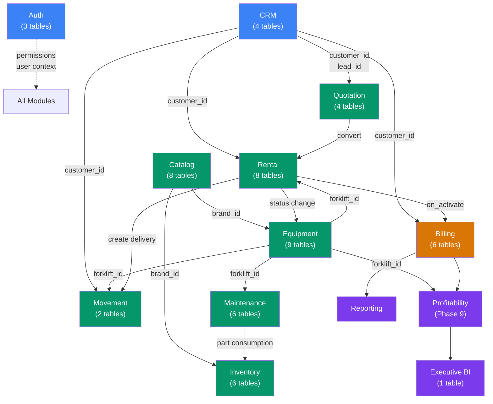

# Module Design — Technical Design Specification

## 1. Module Inventory

| # | Module | Backend Files | Frontend Pages | API Endpoints | DB Tables | Service Classes |
|---|--------|--------------|----------------|---------------|-----------|-----------------|
| 1 | Auth | 6 | 1 (Login) | 15 | 3 | 2 (UserService, RBACService) |
| 2 | CRM | 8 | 4 | 17 | 4 | 3 (CustomerService, LeadService, ActivityLogService) |
| 3 | Catalog | 14 | 6 | 30 | 6 | 4 (BrandService, CategoryService, ProductService, ImportService) |
| 4 | Equipment | 18 | 3 | 22 | 9 | 8 (ForkliftService + 7 sub-services) |
| 5 | Quotation | 6 | 3 | 20 | 4 | 2 (QuotationService, QuotationWorkflowService) |
| 6 | Rental | 10 | 3 | 34 | 8 | 2 (RentalContractService, RentalWorkflowService) |
| 7 | Movement | 4 | 3 | 10 | 2 | 1 (MovementService) |
| 8 | Maintenance | 8 | 4 | 17 | 6 | 1 (MaintenanceService) |
| 9 | Inventory | 6 | 5 | 17 | 6 | 1 (InventoryService) |
| 10 | Billing | 8 | 12 | 29 | 6 | 1 (BillingService) |
| 11 | Reporting | 4 | 2 | 7 | 0 | 2 (DashboardService, ReportService) |
| | **Total** | **92** | **46+** | **218** | **56** | **27** |

## 2. Module Detail — Current State and Refactor Targets

### 2.1 Auth Module

**Backend:** Complete — JWT login/logout/refresh, user CRUD, role management, RBAC engine.

**Frontend:** LoginPage (neon cyber theme), no Settings page.

**Refactor targets:**
- C5: Build Settings page (password change, profile edit)
- C4: Build `<Can permission>` component for UI permission enforcement

**Cross-domain dependencies:** Every module depends on auth for `require_permission()` and `get_current_user()`.

### 2.2 CRM Module

**Backend:** Complete — Customers CRUD, Leads pipeline (7 stages), lead notes, activity logging.

**Frontend:** CustomersPage, LeadsPage (both with inline forms), ActivityPage (62 action types).

**Refactor targets:** None — module is fully functional.

**Gap:** Customer list and lead list not paginated (returns full lists). Will break at >1000 records.

### 2.3 Catalog Module

**Backend:** Complete — 30 endpoints covering brands, categories (3-level tree), products (with specs, images, compat brands), Excel import.

**Frontend:** 6 pages — CatalogPage, ProductDetailPage, ProductForm, BrandsPage, CategoriesPage, ImportPage.

**Refactor targets (Phase 1):**

| # | Item | File(s) | Description |
|---|------|---------|-------------|
| 1.1 | Fix product edit form | ProductForm.tsx | `description_en` not loaded in edit mode |
| 1.2 | Fix useState misuse | BrandsPage.tsx, CategoriesPage.tsx | Modal state stale on reopen — replace with useEffect |
| 1.3 | Build spec/image/compat UI | ProductDetailPage.tsx | 9 API functions exist but no UI calls them |
| 1.4 | Add brand pagination | routes/brands.py, BrandsPage.tsx | Currently returns all brands with limit=100 |
| 1.5 | Remove dead code | brand_service.py, product_service.py | Unused variables, misplaced import |
| 1.6 | Wire or remove slug lookups | product_service.py, brand_service.py | `get_by_slug()` methods with no route |

### 2.4 Equipment Module

**Backend:** Complete — 21 endpoints for core forklift CRUD plus specs, photos, documents, locations, hour meters, costs, status history.

**Frontend:** 3 pages — EquipmentRegistryPage, ForkliftDetailPage, ForkliftForm.

**Refactor targets (Phase 2):**

| # | Item | Description |
|---|------|-------------|
| 2.1 | Build spec form | forklift_specs has 10 fields but only 2 displayed, no add/edit UI |
| 2.2 | Build 6 sub-entity tabs | Photos, documents, locations, hour meters, costs, status — all backend-ready, zero frontend |
| 2.3 | Fix ForkliftForm edit mode | Loses purchase_date, warranty_expiry, initial_hour_meter, notes in edit |
| 2.4 | Remove hardcoded thresholds | 5000/4000/4500 hour meter thresholds, "LAK" currency |
| 2.5 | Fix contracts tab | Shows generic link instead of forklift-specific contracts |

**API coverage gap:** `api/forklift.ts` has only 5 functions. 16 backend endpoints have no frontend caller.

### 2.5 Quotation Module

**Backend:** Complete — 20 endpoints, 10-status workflow (draft → under_review → approved → sent → accepted → converted), approval chain.

**Frontend:** 3 pages — QuotationListPage, QuotationDetailPage, QuotationFormPage.

**Refactor targets (Phase 3):**

| # | Item | Description |
|---|------|-------------|
| 3.1 | Fix form missing fields | No customer picker (critical), no lead/assignee selectors, no validity dates |
| 3.2 | Build edit page | PUT endpoint exists, no edit UI |
| 3.3 | Add date range filters | Backend supports date params, frontend doesn't expose them |
| 3.4 | Replace raw ID inputs | Raw numeric inputs for customer_id and forklift_id |

**CSS issue:** QuotationDetailPage.tsx:18 imports ProductDetailPage.css (cross-module).

### 2.6 Rental Module

**Backend:** Complete — 34 endpoints, 13-status lifecycle, extensions, returns (7-status), damage reports with dispute workflow, billing cycle generation.

**Frontend:** 3 pages — RentalContractListPage, RentalContractDetailPage, RentalContractFormPage.

**Refactor targets (Phase 4):**

| # | Item | Description |
|---|------|-------------|
| 4.1 | Fix form missing fields | No billing_cycle_day, payment_terms, penalty percentages |
| 4.2 | Build edit page | PUT endpoint exists, no edit UI |
| 4.3 | Wire billing generation | Button shows "coming in Phase 4" toast — backend endpoint works |
| 4.4 | Build return flow UI | Return request/pickup/receive/complete + damage reports — all API exists, zero UI |
| 4.5 | Remove hardcoded rules | `monthly_rate / 30` divisor in 3 places |

**CSS issue:** RentalContractDetailPage.tsx:19 imports ProductDetailPage.css (cross-module).

### 2.7 Movement Module

**Backend:** Complete — 10 endpoints, 6-status workflow (draft → preparing → in_transit → delivered → completed), checkpoint logging.

**Frontend:** 3 pages — MovementListPage, MovementDetailPage, MovementForm.

**Refactor targets (Phase 5):**

| # | Item | Description |
|---|------|-------------|
| 5.1 | Fix form missing fields | No contract selector, driver selector, address fields |
| 5.2 | Build edit page | PUT endpoint exists, no edit UI |
| 5.3 | Build checkpoint UI | POST checkpoint endpoint exists, no UI |
| 5.4 | Fix grid pagination | Grid view has no page navigation |
| 5.5 | Add date range filter | Backend supports scheduled_from/to, frontend doesn't expose |

### 2.8 Maintenance Module

**Backend:** Complete — 17 endpoints, work order lifecycle (scheduled → in_progress → completed → verified), PM plans, schedules, costs, part consumption.

**Frontend:** 4 pages + 1 **placeholder** — MaintenanceDashboardPage, WorkOrderListPage, WorkOrderDetailPage, MaintenanceSchedulePage + `/work-orders/new` is a stub.

**Refactor targets (Phase 6):**

| # | Item | Description |
|---|------|-------------|
| 6.1 | **Build Work Order form** | Critical — placeholder must become real form |
| 6.2 | Build edit capability | PUT endpoint exists, no edit UI, no "Edit" button |
| 6.3 | Fix month approximation | `days = months * 30` drifts over time |

### 2.9 Inventory Module

**Backend:** Complete — 17 endpoints, spare parts CRUD, warehouses, inventory balances, transactions (6 types), purchase orders (5-status lifecycle), part consumption.

**Frontend:** 5 pages + 1 **placeholder** — InventoryDashboardPage, SparePartListPage, SparePartDetailPage, WarehousePage, PurchaseOrderPage + `/parts/new` is a stub.

**Refactor targets (Phase 7):**

| # | Item | Description |
|---|------|-------------|
| 7.1 | **Build Spare Part form** | Critical — placeholder must become real form |
| 7.2 | Build edit capability | PUT endpoint exists, no "Edit" button on detail page |
| 7.3 | Add create buttons | PurchaseOrderPage has no "Create PO" button |

### 2.10 Billing Module

**Backend:** Complete — 29 endpoints, invoice lifecycle (8 statuses), payment processing (4 statuses, 6 methods), deposit management (6 statuses), revenue recognition (3 statuses), automation hooks.

**Frontend:** 12 pages — BillingDashboardPage, InvoiceListPage, InvoiceDetailPage, PaymentListPage, PaymentDetailPage, DepositListPage, DepositDetailPage, RevenueRecognitionPage, FinanceDashboardPage, PaymentPage, DepositPage, StatementPage.

**Refactor targets (Phase 8):**

| # | Item | Description |
|---|------|-------------|
| 8.1 | Add create buttons | Invoice, payment, deposit list pages have no "Create" button |
| 8.2 | Replace alert() with toast | DepositDetailPage and RevenueRecognitionPage use raw alert() |
| 8.3 | Replace raw modal | DepositDetailPage builds custom modal div instead of shared Modal |
| 8.4 | Wire updateInvoice | PUT endpoint exists, no edit UI for draft invoices |

### 2.11 Reporting Module

**Backend:** Partial — dashboard summary (4 endpoints), CSV/Excel export (3 report types).

**Frontend:** 2 pages — DashboardPage, ExecutiveDashboardPage.

**Refactor targets (Phase 10):**

| # | Item | Description |
|---|------|-------------|
| 10.1 | Build unified Executive API | Current page makes 8 separate API calls |
| 10.2 | Add date range selector | Always shows all-time data |
| 10.3 | Add KPI targets | No target-setting or actual-vs-plan UI |
| 10.4 | Add chart drill-down | Charts are display-only, not clickable |

### 2.12 Profitability Module (NEW — Phase 9)

**Backend:** Does not exist yet. Data sources exist (ownership costs, maintenance costs, part consumptions, invoices, deposits).

**Frontend:** Does not exist.

**New files required:**

| File | Type | Purpose |
|------|------|---------|
| `services/profitability_service.py` | Backend | Aggregation engine — revenue vs costs per asset/contract |
| `routes/profitability.py` | Backend | 4 GET endpoints |
| `schemas/profitability.py` | Backend | Response DTOs |
| `types/profitability.ts` | Frontend | TypeScript interfaces |
| `api/profitability.ts` | Frontend | API client (4 functions) |
| `pages/Profitability/ProfitabilityDashboardPage.tsx` | Frontend | KPI cards + fleet table + charts |
| `pages/Profitability/AssetProfitabilityPage.tsx` | Frontend | Per-asset P&L detail |

## 3. Cross-Module Dependencies



## 4. New Module Entry Points (refactor plan)

### SearchSelect Component (Phase 3, reused in 4-5-6-7)

Reusable async search select for entity pickers. Used to replace raw numeric ID inputs.

```typescript
interface SearchSelectProps {
  endpoint: string;          // API path to search
  labelField: string;        // field to display (e.g., "first_name")
  valueField: string;        // field to use as value (e.g., "id")
  value: number | null;
  onChange: (id: number | null) => void;
  placeholder?: string;
  minChars?: number;         // default 2
  debounceMs?: number;       // default 300
}
```

### Can Component (Phase C4)

Permission-aware wrapper for UI elements.

```typescript
interface CanProps {
  permission: string;
  children: React.ReactNode;
  fallback?: React.ReactNode;
}
// Usage: <Can permission="FORKLIFT_CREATE"><button>Add Forklift</button></Can>
```

Reads user role from authStore, maps to frontend permission set derived from ROLE_PERMISSIONS.
