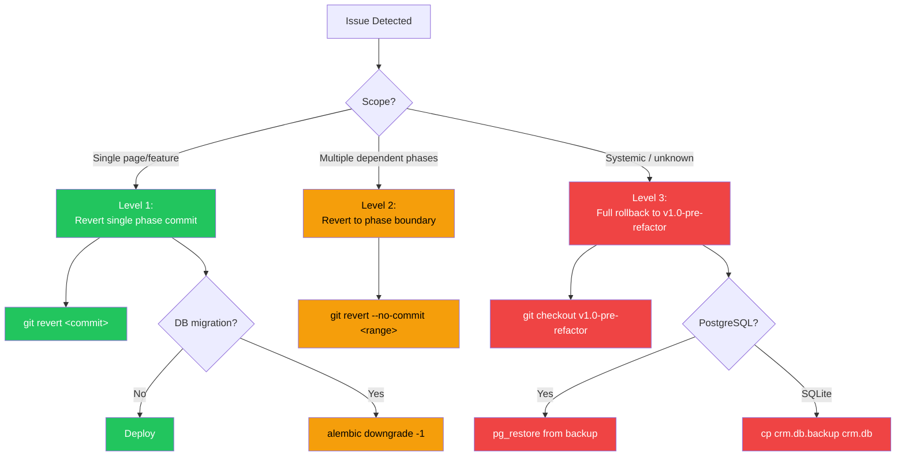

# Rollback Plan — Technical Design Specification

### Rollback Decision Tree



## 1. Rollback Strategy

Every refactor phase is committed as a separate git commit with a descriptive message. This enables surgical rollback of any individual phase without affecting others.

### Commit Convention

```
refactor: extract shared CSS + types, replace alert with toast (C1+C2+C3)
feat: harden product catalog — edit fix, pagination, spec UI (Phase 1)
feat: complete equipment registry — sub-entity tabs, edit fix (Phase 2)
feat: quotation form enhancements + edit page (Phase 3)
feat: rental contract form + returns UI + billing wire (Phase 4)
feat: movement form enhancements + checkpoint UI (Phase 5)
feat: work order creation form + edit (Phase 6)
feat: spare part creation form + PO button (Phase 7)
feat: billing create modals + UX fixes (Phase 8)
feat: permission-aware UI + settings page (C4+C5)
feat: profitability analysis engine + dashboard (Phase 9)
feat: executive BI analytics backend + enhancements (Phase 10)
```

### Pre-Refactor Tag

```bash
git tag v1.0-pre-refactor
```

This tag marks the exact state before any refactor work begins. Full rollback to this state is always possible.

## 2. Rollback Procedures by Phase

### Level 1: Revert Single Phase (surgical)

```bash
# Find the phase commit
git log --oneline | grep "Phase N"

# Revert it (creates a new revert commit)
git revert <commit-hash>

# If revert has conflicts, resolve them:
git status
# Edit conflicting files
git add .
git revert --continue
```

**When to use:** A specific phase introduced a regression. Other phases are fine.

### Level 2: Revert to Phase Boundary (cascade)

```bash
# Revert all commits after a specific phase
git log --oneline
# Identify the last good commit hash

# Interactive revert (safest)
git revert --no-commit <bad-commit-1> <bad-commit-2> <bad-commit-3>
git commit -m "revert: roll back phases N-M due to <reason>"
```

**When to use:** Multiple dependent phases need rollback (e.g., Phase 9+10 together).

### Level 3: Full Rollback (nuclear)

```bash
# Return to pre-refactor state
git checkout v1.0-pre-refactor

# Or create a new branch from pre-refactor state
git checkout -b main-rolled-back v1.0-pre-refactor
```

**When to use:** Catastrophic failure. All refactor work must be abandoned.

## 3. Per-Phase Rollback Details

### C1: CSS Extraction

**Revert impact:** 6 files revert to importing `ProductDetailPage.css` cross-module.

**Verification after rollback:**
- All detail pages render correctly
- No missing styles

**Risk:** NONE — purely cosmetic reorganization.

### C2: Shared Types

**Revert impact:** CustomerBrief/UserBrief/ForkliftBrief return to being duplicated in 4 files.

**Verification:** `npm run build` succeeds.

**Risk:** NONE — compile-time only change.

### C3: alert() → toast

**Revert impact:** DepositDetailPage and RevenueRecognitionPage use raw `alert()` again.

**Risk:** NONE — functional behavior unchanged.

### Phase 1: Catalog Hardening

**Revert impact:**
- ProductForm loses description_en fix → edit mode shows empty description
- BrandsPage/CategoriesPage modals may show stale state
- ProductDetailPage loses spec/image/compat tabs
- Brand API response reverts to `list[]` format

**Special handling:** If frontend was updated for paginated brand response, must revert frontend too.

**Database:** No schema changes to revert.

### Phase 2: Equipment

**Revert impact:**
- ForkliftDetailPage loses 6 sub-entity tabs
- ForkliftForm edit mode loses field fixes
- 18 API functions removed from api/forklift.ts

**Database:** No schema changes.

**Risk:** LOW — all changes are additive UI features.

### Phase 3: Quotation

**Revert impact:**
- QuotationFormPage loses customer picker, reverts to raw ID input
- Edit route `/quotations/:id/edit` removed
- SearchSelect component removed

**Dependency warning:** If Phases 4-7 were deployed after Phase 3, they depend on SearchSelect. Must revert 4-7 first, or leave SearchSelect in place.

**Risk:** MEDIUM — dependency chain on SearchSelect.

### Phase 4: Rental

**Revert impact:**
- RentalContractFormPage loses penalty/billing fields
- Billing generation button reverts to stub toast
- Return flow UI removed
- Rate divisor reverts to `monthly_rate / 30`

**Calculation impact:** Reverting the rate divisor means new contracts use the old approximation again. Existing invoices are unaffected.

**Risk:** MEDIUM — functional behavior change.

### Phase 5: Movement

**Revert impact:** Movement form loses fields, checkpoint UI removed, grid pagination broken again.

**Risk:** LOW — all additive UI.

### Phase 6: Maintenance

**Revert impact:**
- WorkOrderFormPage.tsx deleted
- Route `/maintenance/work-orders/new` reverts to Placeholder
- Month approximation reverts to `days = months * 30`

**Risk:** LOW — reverts to previous placeholder state.

### Phase 7: Inventory

**Revert impact:**
- SparePartFormPage.tsx deleted
- Route `/inventory/parts/new` reverts to Placeholder
- PO create button removed

**Risk:** LOW — reverts to previous placeholder state.

### Phase 8: Billing

**Revert impact:**
- Create buttons removed from invoice/payment/deposit list pages
- DepositDetailPage reverts to raw alert() and custom modal
- Invoice edit capability removed

**Risk:** LOW — all additive features.

### Phase C4+C5: Permissions + Settings

**Revert impact:**
- Can component removed → all sidebar items visible to all roles again
- Settings page reverts to Placeholder → users can't change password

**Risk:** MEDIUM — security regression (all items visible) and UX regression (no password change).

### Phase 9: Profitability

**Revert impact:**
- `profitability_service.py`, `routes/profitability.py`, `schemas/profitability.py` deleted
- `PROFITABILITY_READ` permission removed from PermissionName
- 3 frontend pages + API client deleted
- Sidebar loses "Profitability" link
- 4 API endpoints become 404

**Special handling:**
- Remove PROFITABILITY_READ from ROLE_PERMISSIONS before removing from enum
- If kpi_targets table was created via Alembic: `alembic downgrade -1`

**Risk:** LOW — entirely new feature, no existing functionality affected.

### Phase 10: Executive BI

**Revert impact:**
- `executive_service.py`, `routes/executive.py`, `schemas/executive.py` deleted
- ExecutiveDashboardPage reverts to 8 separate API calls (still works, just slower)
- Date range picker, KPI targets, drill-down removed
- 3 API endpoints become 404

**Risk:** LOW — page still functional after revert (just loses enhancements).

## 4. Database Rollback

### Alembic Migrations

```bash
# Check current revision
alembic current

# Rollback one step
alembic downgrade -1

# Rollback to specific revision
alembic downgrade <revision-hash>

# Rollback to base (all migrations)
alembic downgrade base
```

### SQLite (Development)

```bash
# Restore from backup
cp backend/crm.db.backup backend/crm.db
```

### PostgreSQL (Production)

```bash
# Option 1: Alembic downgrade
docker exec dk-backend alembic downgrade -1

# Option 2: Restore from backup
docker exec dk-db pg_restore -U dk_user -d dk_crm /backup/pre-refactor.dump
```

## 5. Rollback Decision Matrix

| Symptom | Likely Cause | Rollback Action |
|---------|-------------|----------------|
| Pages render with missing styles | C1 CSS extraction incomplete | Revert C1 |
| TypeScript build fails after deploy | C2 type extraction missed an importer | Revert C2 |
| Users report hidden buttons/menu items | C4 permission mapping too restrictive | Revert C4 |
| Quotation form can't save (missing customer_id) | Phase 3 form change broke required field | Revert Phase 3 |
| Contract billing amounts wrong | Phase 4 rate divisor calculation error | Revert Phase 4 |
| PM schedule dates shifted unexpectedly | Phase 6 month calculation change | Revert Phase 6 |
| 500 errors on /profitability/* | Phase 9 service has a query bug | Revert Phase 9 |
| Executive dashboard blank | Phase 10 unified API returns empty | Revert Phase 10 |
| Multiple issues across phases | Systemic integration problem | Full rollback to `v1.0-pre-refactor` |

## 6. Communication Plan

| When | Who | What |
|------|-----|------|
| Before refactor starts | All DK staff | Notify about upcoming changes, schedule maintenance window |
| After each phase deploys | QA / key users | Verify specific module functionality |
| If rollback needed | All DK staff | Notify about temporary reversion, ETA for fix |
| After full refactor complete | All DK staff | Summary of improvements, new features available |

## 7. Recovery Time Objectives

| Rollback Level | Estimated Time |
|----------------|---------------|
| Single phase revert | 5 minutes (git revert + rebuild + redeploy) |
| Multi-phase revert | 15 minutes |
| Full rollback to tag | 10 minutes (git checkout + rebuild + redeploy) |
| Database restore (SQLite) | 1 minute |
| Database restore (PostgreSQL) | 5-10 minutes |
