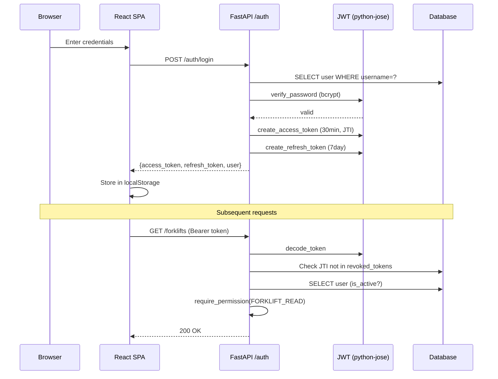
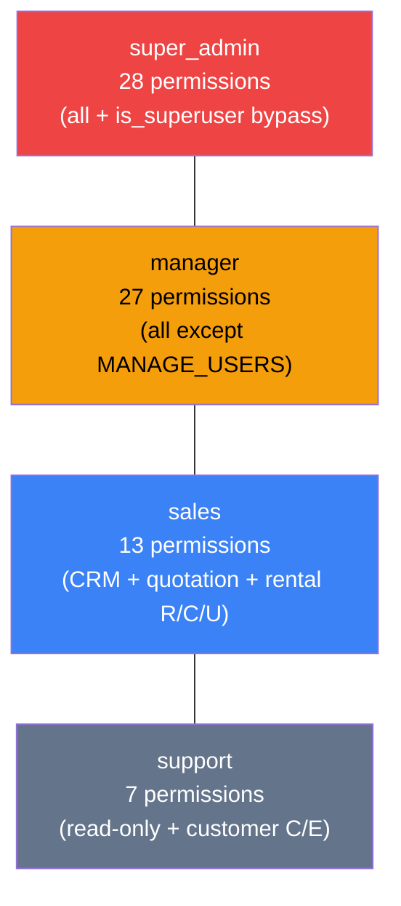

# Security Design — Technical Design Specification

## 1. Authentication

### Authentication Flow



### 1.1 JWT Token Architecture

| Token Type | Algorithm | Expiry | Payload | Revocable |
|-----------|-----------|--------|---------|-----------|
| Access Token | HS256 | 30 min | `{sub: user_id, exp, type: "access", jti: uuid4}` | Yes (via `revoked_tokens` table) |
| Refresh Token | HS256 | 7 days | `{sub: user_id, exp, type: "refresh"}` | No (no JTI) |

- Secret key: `settings.SECRET_KEY` (env var, default is placeholder — must change in production)
- Library: `python-jose[cryptography]` for JWT, `bcrypt` for password hashing
- Tokens are stateless except for JTI revocation check on access tokens

### 1.2 Password Security

| Mechanism | Implementation |
|-----------|---------------|
| Hashing | bcrypt with auto-generated salt |
| Verification | `bcrypt.checkpw(plain, hashed)` |
| Min length | Not enforced at schema level (refactor gap) |
| Complexity | Not enforced (refactor gap) |

### 1.3 Login Flow

```
POST /api/v1/auth/login {username, password}
  → SELECT user WHERE username = ?
  → verify_password(plain, hashed)
  → create_access_token(user.id)  → JWT with JTI
  → create_refresh_token(user.id) → JWT without JTI
  → Return {access_token, refresh_token, user}
```

### 1.4 Token Validation (per-request)

```
Request → HTTPBearer extracts token
  → decode_token(token) via python-jose
  → Validate type == "access"
  → Check JTI not in revoked_tokens table
  → Fetch user by sub (user_id)
  → Reject if user.is_active == False
  → Return User object
```

### 1.5 Logout / Token Revocation

```
POST /api/v1/auth/logout
  → decode_token(token) → extract JTI
  → INSERT revoked_tokens (jti)
  → Return 204
```

### 1.6 Token Refresh

```
POST /api/v1/auth/refresh {refresh_token}
  → decode_token(refresh_token)
  → Validate type == "refresh"
  → create_access_token(user_id) → new JWT with new JTI
  → Return {access_token}
```

## 2. Authorization (RBAC)

### 2.1 Role Hierarchy



| Role | Permission Count | Scope |
|------|-----------------|-------|
| `super_admin` | 28 (all) | Full system access, bypasses all checks |
| `manager` | 27 | All except `MANAGE_USERS` |
| `sales` | 13 | CRM + quotation + rental read/create/update |
| `support` | 7 | Read-only + customer create/edit |

### 2.2 Permission Matrix (28 permissions)

| Permission | super_admin | manager | sales | support |
|-----------|:-----------:|:-------:|:-----:|:-------:|
| `VIEW_DASHBOARD` | ✓ | ✓ | ✓ | ✓ |
| `CREATE_CUSTOMER` | ✓ | ✓ | ✓ | ✓ |
| `EDIT_CUSTOMER` | ✓ | ✓ | ✓ | ✓ |
| `DELETE_CUSTOMER` | ✓ | ✓ | — | — |
| `CREATE_LEAD` | ✓ | ✓ | ✓ | — |
| `EDIT_LEAD` | ✓ | ✓ | ✓ | — |
| `DELETE_LEAD` | ✓ | ✓ | — | — |
| `MANAGE_USERS` | ✓ | — | — | — |
| `MANAGE_CATALOG` | ✓ | ✓ | — | — |
| `FORKLIFT_READ` | ✓ | ✓ | ✓ | ✓ |
| `FORKLIFT_CREATE` | ✓ | ✓ | — | — |
| `FORKLIFT_UPDATE` | ✓ | ✓ | — | — |
| `FORKLIFT_DELETE` | ✓ | ✓ | — | — |
| `QUOTATION_READ` | ✓ | ✓ | ✓ | ✓ |
| `QUOTATION_CREATE` | ✓ | ✓ | ✓ | — |
| `QUOTATION_UPDATE` | ✓ | ✓ | ✓ | — |
| `QUOTATION_DELETE` | ✓ | ✓ | — | — |
| `QUOTATION_APPROVE` | ✓ | ✓ | — | — |
| `QUOTATION_CONVERT` | ✓ | ✓ | — | — |
| `RENTAL_READ` | ✓ | ✓ | ✓ | ✓ |
| `RENTAL_CREATE` | ✓ | ✓ | ✓ | — |
| `RENTAL_UPDATE` | ✓ | ✓ | ✓ | — |
| `RENTAL_DELETE` | ✓ | ✓ | — | — |
| `RENTAL_APPROVE` | ✓ | ✓ | — | — |
| `RENTAL_DELIVER` | ✓ | ✓ | — | — |
| `RENTAL_INSPECT` | ✓ | ✓ | — | — |
| `RENTAL_SETTLE` | ✓ | ✓ | — | — |
| `BILLING_READ` | ✓ | ✓ | ✓ | ✓ |
| `BILLING_CREATE` | ✓ | ✓ | — | — |
| `BILLING_UPDATE` | ✓ | ✓ | — | — |
| `BILLING_APPROVE` | ✓ | ✓ | — | — |

### 2.3 Permission Enforcement

```python
def require_permission(permission: PermissionName):
    # Returns FastAPI Depends() that:
    # 1. Calls get_current_user (JWT validation)
    # 2. If user.is_superuser: bypass (return user)
    # 3. Load user's role from DB
    # 4. Check role is active
    # 5. Check permission in ROLE_PERMISSIONS[role_name]
    # 6. Return 403 if denied
```

### 2.4 Superuser Bypass

`is_superuser=True` on the User model bypasses all permission checks. This is independent of the role system and provides backward compatibility with the original admin account.

## 3. HTTP Security

### 3.1 CORS Configuration

| Setting | Value |
|---------|-------|
| `allow_origins` | 6 localhost entries (ports 3000, 8080, 5173, 5174) |
| `allow_credentials` | `True` |
| `allow_methods` | `["*"]` |
| `allow_headers` | `["*"]` |

**Production action:** Restrict `allow_origins` to actual deployment domain(s).

### 3.2 Security Headers (defined, not registered)

| Header | Value | Purpose |
|--------|-------|---------|
| `X-Content-Type-Options` | `nosniff` | Prevent MIME sniffing |
| `X-Frame-Options` | `DENY` | Prevent clickjacking |
| `X-XSS-Protection` | `1; mode=block` | XSS filter (legacy browsers) |
| `Referrer-Policy` | `strict-origin-when-cross-origin` | Limit referrer leakage |
| `Permissions-Policy` | `camera=(), microphone=(), geolocation=()` | Disable browser features |
| `Cache-Control` | `no-store` | Prevent sensitive data caching |

**Production action:** Register `SecurityHeadersMiddleware` in `main.py`.

### 3.3 Request ID Correlation

`RequestIdMiddleware` (defined, not registered):
- Reads `X-Request-ID` from request or generates 12-char hex UUID
- Attaches to `request.state.request_id`
- Returns in `X-Request-ID` response header
- Logs: `method path status elapsed_ms`

## 4. File Upload Security

`routes/uploads.py`:

| Control | Implementation |
|---------|---------------|
| MIME whitelist | `image/jpeg`, `image/png`, `image/webp` |
| Extension whitelist | `.jpg`, `.jpeg`, `.png`, `.webp` |
| Dangerous extension blacklist | `.exe`, `.bat`, `.cmd`, `.sh`, `.ps1`, `.dll`, `.so`, `.php`, `.py`, `.rb`, `.js`, `.html`, `.htm`, `.svg` |
| Max file size | `settings.MAX_UPLOAD_SIZE_MB` (5 MB) — checked after full read |
| Filename sanitization | UUID hex filename, original name discarded |
| Storage path | `uploads/images/{uuid}.{ext}` |
| Permission required | `FORKLIFT_UPDATE` |

### Security gaps

| Gap | Risk | Mitigation |
|-----|------|-----------|
| File is fully read into memory before size check | DoS via large upload | Add `Content-Length` header check before reading |
| No virus/malware scanning | Malicious image files | Add ClamAV or similar on production |
| Static files served directly by FastAPI | No auth on uploaded files | Move to Nginx with auth proxy for sensitive files |

## 5. Database Security

| Control | Implementation |
|---------|---------------|
| SQL Injection | SQLAlchemy ORM — parameterized queries throughout |
| Connection security | `pool_pre_ping=True` for PostgreSQL (detects stale connections) |
| Credential storage | Database URL in `.env` file (not committed to git) |
| Cascade deletes | `ondelete="CASCADE"` for child records, `ondelete="RESTRICT"` for critical references |

## 6. Frontend Security

| Control | Implementation |
|---------|---------------|
| Token storage | `localStorage` (accessible to XSS — acceptable for internal tool) |
| Auto-redirect | 401 response → clear auth → redirect to `/login` |
| No raw HTML rendering | React's JSX auto-escapes — no `dangerouslySetInnerHTML` usage |
| SPA routing | Nginx `try_files` prevents path traversal |

## 7. Security Gaps to Address

| # | Gap | Priority | Refactor Phase |
|---|-----|----------|---------------|
| 1 | No rate limiting on login endpoint | HIGH | C-cross-cutting |
| 2 | Security headers middleware not registered | HIGH | Production deploy |
| 3 | RequestID middleware not registered | MEDIUM | Production deploy |
| 4 | No password complexity requirements | MEDIUM | Phase C5 (Settings) |
| 5 | Frontend shows all sidebar items to all roles | HIGH | Phase C4 |
| 6 | Secret key has a placeholder default | CRITICAL | Production deploy |
| 7 | Refresh token has no JTI (not individually revocable) | LOW | Future |
| 8 | No CSRF protection | LOW | Acceptable for JWT-based SPA |
| 9 | No audit logging for failed login attempts | MEDIUM | Future |
| 10 | Upload reads entire file into memory | LOW | Future |
