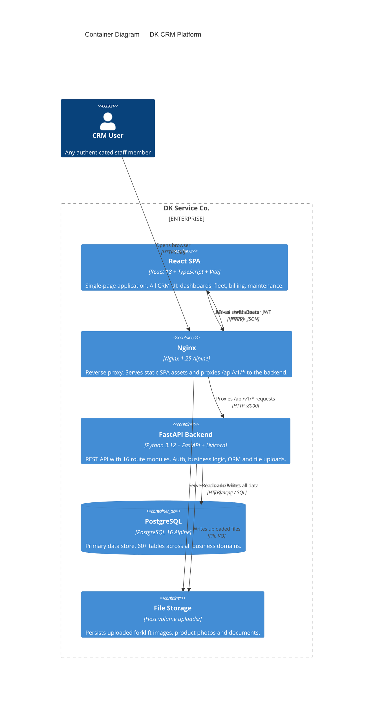

```mermaid
C4Container
    title Container Diagram — DK CRM Platform

    Person(user, "CRM User", "Any authenticated staff member")

    Enterprise_Boundary(dkco, "DK Service Co.") {
        Container(spa, "React SPA", "React 18 + TypeScript + Vite", "Single-page application. All CRM UI: dashboards, fleet, billing, maintenance.")
        Container(nginx, "Nginx", "Nginx 1.25 Alpine", "Reverse proxy. Serves static SPA assets and proxies /api/v1/* to the backend.")
        Container(api, "FastAPI Backend", "Python 3.12 + FastAPI + Uvicorn", "REST API with 16 route modules. Auth, business logic, ORM and file uploads.")
        ContainerDb(db, "PostgreSQL", "PostgreSQL 16 Alpine", "Primary data store. 60+ tables across all business domains.")
        Container(storage, "File Storage", "Host volume  uploads/", "Persists uploaded forklift images, product photos and documents.")
    }

    Rel(user, nginx, "Opens browser", "HTTPS :80")
    Rel(nginx, spa, "Serves static assets", "HTTP")
    Rel(nginx, api, "Proxies /api/v1/* requests", "HTTP :8000")
    Rel(spa, nginx, "API calls with Bearer JWT", "HTTPS + JSON")
    Rel(api, db, "Reads and writes all data", "asyncpg / SQL")
    Rel(api, storage, "Writes uploaded files", "File I/O")
    Rel(nginx, storage, "Serves /uploads/* files", "HTTP")

    UpdateLayoutConfig($c4ShapeInRow="3", $c4BoundaryInRow="1")
```
