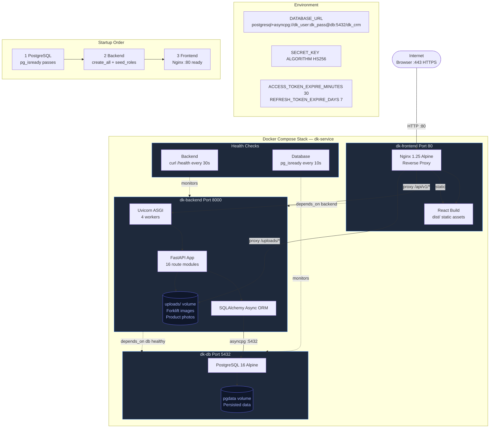

```mermaid
graph TB
    Internet(["Internet\nBrowser :443 HTTPS"])

    subgraph DC["Docker Compose Stack — dk-service"]
        direction TB

        subgraph FE["dk-frontend  Port 80"]
            Nginx["Nginx 1.25 Alpine\nReverse Proxy"]
            StaticDist["React Build\ndist/ static assets"]
            Nginx --> StaticDist
        end

        subgraph BE["dk-backend  Port 8000"]
            Uvicorn["Uvicorn ASGI\n4 workers"]
            FastApp["FastAPI App\n16 route modules"]
            SQLAlch["SQLAlchemy Async ORM"]
            UploadVol[("uploads/ volume\nForklift images\nProduct photos")]
            Uvicorn --> FastApp --> SQLAlch
            FastApp --> UploadVol
        end

        subgraph DB["dk-db  Port 5432"]
            PG["PostgreSQL 16 Alpine"]
            PGVol[("pgdata volume\nPersisted data")]
            PG --> PGVol
        end

        subgraph HC["Health Checks"]
            HC1["Backend\ncurl /health every 30s"]
            HC2["Database\npg_isready every 10s"]
        end
    end

    subgraph ENV["Environment"]
        E1["DATABASE_URL\npostgresql+asyncpg://dk_user:dk_pass@db:5432/dk_crm"]
        E2["SECRET_KEY  ALGORITHM HS256"]
        E3["ACCESS_TOKEN_EXPIRE_MINUTES 30\nREFRESH_TOKEN_EXPIRE_DAYS 7"]
    end

    subgraph SEQ["Startup Order"]
        S1["1 PostgreSQL\npg_isready passes"]
        S2["2 Backend\ncreate_all + seed_roles"]
        S3["3 Frontend\nNginx :80 ready"]
        S1 --> S2 --> S3
    end

    Internet -->|"HTTP :80"| Nginx
    Nginx -->|"static"| StaticDist
    Nginx -->|"proxy /api/v1/*"| Uvicorn
    Nginx -->|"proxy /uploads/*"| UploadVol
    SQLAlch -->|"asyncpg :5432"| PG

    HC1 -.->|"monitors"| BE
    HC2 -.->|"monitors"| DB
    BE -.->|"depends_on db healthy"| DB
    FE -.->|"depends_on backend"| BE

    classDef ctr fill:#1e293b,stroke:#3b82f6,color:#e2e8f0
    classDef vol fill:#0f172a,stroke:#6366f1,color:#a5b4fc
    class FE,BE,DB,HC ctr
    class PGVol,UploadVol vol
```
