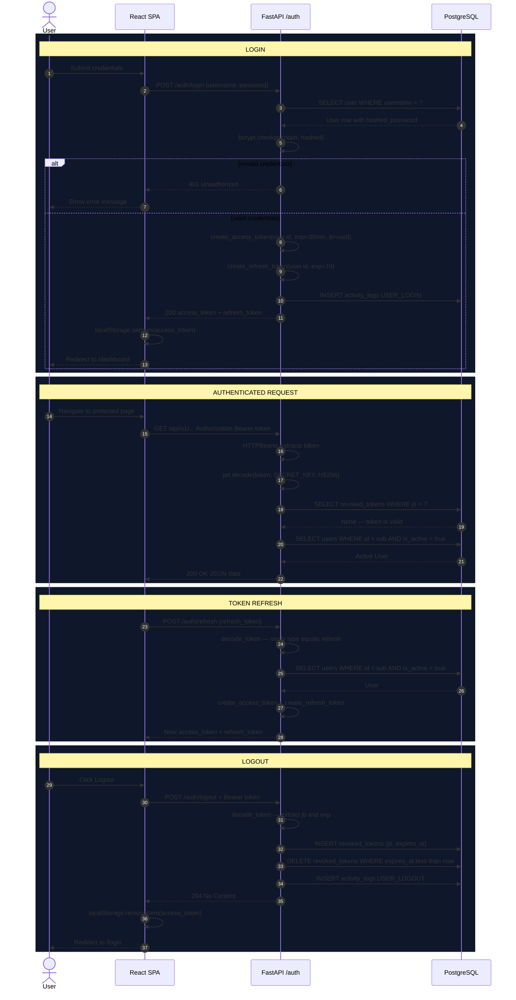

```mermaid
sequenceDiagram
    autonumber
    actor User
    participant FE as React SPA
    participant API as FastAPI /auth
    participant DB as PostgreSQL

    rect rgb(15,23,42)
        Note over User,DB: LOGIN
        User->>FE: Submit credentials
        FE->>API: POST /auth/login {username, password}
        API->>DB: SELECT user WHERE username = ?
        DB-->>API: User row with hashed_password
        API->>API: bcrypt.checkpw(plain, hashed)
        alt invalid credentials
            API-->>FE: 401 Unauthorized
            FE-->>User: Show error message
        else valid credentials
            API->>API: create_access_token(user.id, exp=30min, jti=uuid)
            API->>API: create_refresh_token(user.id, exp=7d)
            API->>DB: INSERT activity_logs USER_LOGIN
            API-->>FE: 200 access_token + refresh_token
            FE->>FE: localStorage.setItem(access_token)
            FE-->>User: Redirect to /dashboard
        end
    end

    rect rgb(15,23,42)
        Note over User,DB: AUTHENTICATED REQUEST
        User->>FE: Navigate to protected page
        FE->>API: GET /api/v1/... Authorization Bearer token
        API->>API: HTTPBearer extracts token
        API->>API: jwt.decode(token, SECRET_KEY, HS256)
        API->>DB: SELECT revoked_tokens WHERE jti = ?
        DB-->>API: None — token is valid
        API->>DB: SELECT users WHERE id = sub AND is_active = true
        DB-->>API: Active User
        API-->>FE: 200 OK JSON data
    end

    rect rgb(15,23,42)
        Note over User,DB: TOKEN REFRESH
        FE->>API: POST /auth/refresh {refresh_token}
        API->>API: decode_token — verify type equals refresh
        API->>DB: SELECT users WHERE id = sub AND is_active = true
        DB-->>API: User
        API->>API: create_access_token + create_refresh_token
        API-->>FE: New access_token + refresh_token
    end

    rect rgb(15,23,42)
        Note over User,DB: LOGOUT
        User->>FE: Click Logout
        FE->>API: POST /auth/logout + Bearer token
        API->>API: decode_token — extract jti and exp
        API->>DB: INSERT revoked_tokens (jti, expires_at)
        API->>DB: DELETE revoked_tokens WHERE expires_at less than now
        API->>DB: INSERT activity_logs USER_LOGOUT
        API-->>FE: 204 No Content
        FE->>FE: localStorage.removeItem(access_token)
        FE-->>User: Redirect to /login
    end
```
