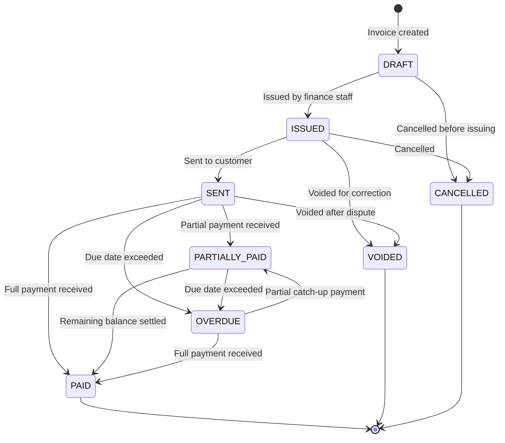

```mermaid
stateDiagram-v2
    [*] --> DRAFT : Invoice created

    DRAFT --> ISSUED : Issued by finance staff
    DRAFT --> CANCELLED : Cancelled before issuing

    ISSUED --> SENT : Sent to customer
    ISSUED --> CANCELLED : Cancelled

    SENT --> PARTIALLY_PAID : Partial payment received
    SENT --> PAID : Full payment received
    SENT --> OVERDUE : Due date exceeded

    PARTIALLY_PAID --> PAID : Remaining balance settled
    PARTIALLY_PAID --> OVERDUE : Due date exceeded

    OVERDUE --> PARTIALLY_PAID : Partial catch-up payment
    OVERDUE --> PAID : Full payment received

    ISSUED --> VOIDED : Voided for correction
    SENT --> VOIDED : Voided after dispute

    PAID --> [*]
    VOIDED --> [*]
    CANCELLED --> [*]
```
