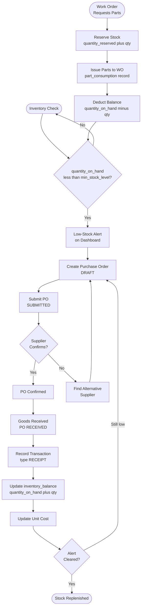

```mermaid
flowchart TD
    A(["Inventory Check"])
    B{"quantity_on_hand\nless than min_stock_level?"}
    C["Low-Stock Alert\non Dashboard"]
    D["Create Purchase Order\nDRAFT"]
    E["Submit PO\nSUBMITTED"]
    F{"Supplier\nConfirms?"}
    G["PO Confirmed"]
    H["Find Alternative\nSupplier"]
    I["Goods Received\nPO RECEIVED"]
    J["Record Transaction\ntype RECEIPT"]
    K["Update inventory_balance\nquantity_on_hand plus qty"]
    L["Update Unit Cost"]
    M{"Alert\nCleared?"}
    N(["Stock Replenished"])
    WO(["Work Order\nRequests Parts"])
    WO2["Reserve Stock\nquantity_reserved plus qty"]
    WO3["Issue Parts to WO\npart_consumption record"]
    WO4["Deduct Balance\nquantity_on_hand minus qty"]

    A --> B
    B -->|"No"| A
    B -->|"Yes"| C --> D --> E --> F
    F -->|"Yes"| G --> I
    F -->|"No"| H --> D
    I --> J --> K --> L --> M
    M -->|"Yes"| N
    M -->|"Still low"| D

    WO --> WO2 --> WO3 --> WO4 --> B
```
