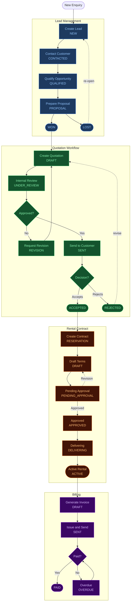

```mermaid
flowchart TD
    Start(["New Enquiry"])

    subgraph LM["Lead Management"]
        L1["Create Lead\nNEW"]
        L2["Contact Customer\nCONTACTED"]
        L3["Qualify Opportunity\nQUALIFIED"]
        L4["Prepare Proposal\nPROPOSAL"]
        LW(["WON"])
        LL(["LOST"])
    end

    subgraph QW["Quotation Workflow"]
        Q1["Create Quotation\nDRAFT"]
        Q2["Internal Review\nUNDER_REVIEW"]
        QA{"Approved?"}
        Q3["Request Revision\nREVISION"]
        Q4["Send to Customer\nSENT"]
        QB{"Decision?"}
        Q5(["ACCEPTED"])
        Q6(["REJECTED"])
    end

    subgraph RC["Rental Contract"]
        R1["Create Contract\nRESERVATION"]
        R2["Draft Terms\nDRAFT"]
        R3["Pending Approval\nPENDING_APPROVAL"]
        R4["Approved\nAPPROVED"]
        R5["Delivering\nDELIVERING"]
        R6(["Active Rental\nACTIVE"])
    end

    subgraph BL["Billing"]
        B1["Generate Invoice\nDRAFT"]
        B2["Issue and Send\nSENT"]
        B3{"Paid?"}
        B4(["PAID"])
        B5["Overdue\nOVERDUE"]
    end

    Start --> L1
    L1 --> L2 --> L3 --> L4
    L4 --> LW & LL
    LL -.->|"re-open"| L1

    LW --> Q1
    Q1 --> Q2 --> QA
    QA -->|"No"| Q3 --> Q1
    QA -->|"Yes"| Q4 --> QB
    QB -->|"Accepts"| Q5
    QB -->|"Rejects"| Q6
    Q6 -.->|"revise"| Q1

    Q5 --> R1 --> R2 --> R3
    R3 -->|"Approved"| R4 --> R5 --> R6
    R3 -.->|"Revision"| R2

    R6 --> B1 --> B2 --> B3
    B3 -->|"Yes"| B4
    B3 -->|"No"| B5 --> B3

    classDef lead fill:#1e3a5f,stroke:#3b82f6,color:#93c5fd
    classDef quote fill:#14532d,stroke:#22c55e,color:#86efac
    classDef rent fill:#431407,stroke:#f97316,color:#fdba74
    classDef bill fill:#3b0764,stroke:#a855f7,color:#d8b4fe
    class L1,L2,L3,L4,LW,LL lead
    class Q1,Q2,Q3,Q4,Q5,Q6,QA,QB quote
    class R1,R2,R3,R4,R5,R6 rent
    class B1,B2,B3,B4,B5 bill
```
