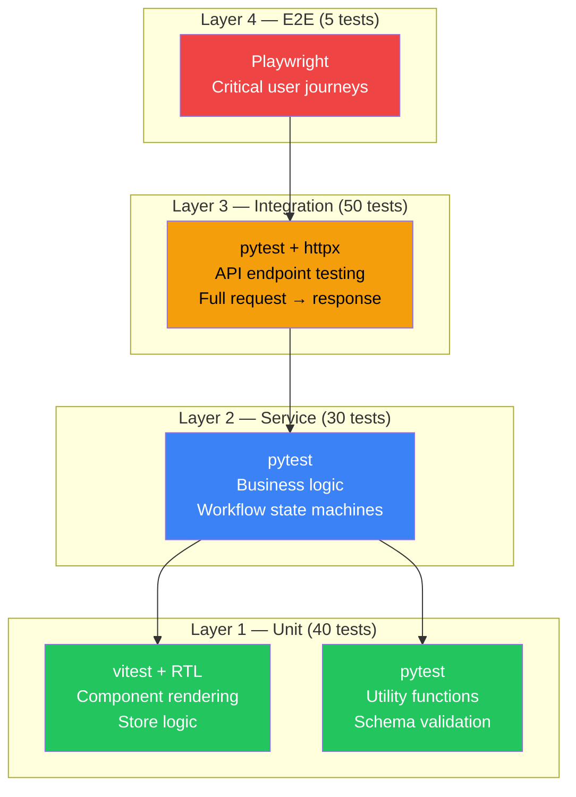
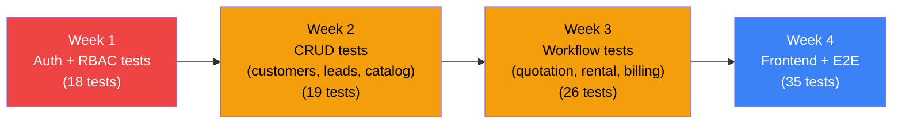

# Testing Strategy — DK Service Enterprise Platform

## Current State

| Metric | Value |
|--------|-------|
| Backend tests | **0** |
| Frontend tests | **0** |
| E2E tests | **0** |
| Test frameworks installed | **None** |
| CI/CD pipeline | **None** |

---

## 1. Test Architecture



## 2. Backend Testing (pytest)

### 2.1 Setup

```bash
# Add to requirements.txt:
pytest>=8.0
pytest-asyncio>=0.24
httpx>=0.27           # async test client for FastAPI
pytest-cov>=5.0
factory-boy>=3.3      # test data factories
```

### 2.2 Test Structure

```
backend/tests/
├── conftest.py              # fixtures: async engine, test db, test client, auth headers
├── factories.py             # SQLAlchemy model factories (User, Customer, Forklift, etc.)
├── test_auth.py             # login, logout, refresh, token validation
├── test_users.py            # CRUD, role assignment, superuser checks
├── test_customers.py        # CRUD, status transitions, search
├── test_leads.py            # CRUD, pipeline stages, notes
├── test_catalog.py          # brands, categories, products, import
├── test_forklifts.py        # CRUD, specs, photos, documents, costs, status
├── test_quotations.py       # CRUD, workflow (submit→approve→send→accept→convert)
├── test_rentals.py          # CRUD, workflow (activate→deliver→return→close), billing hooks
├── test_movements.py        # CRUD, workflow (prepare→depart→arrive→complete), checkpoints
├── test_maintenance.py      # plans, schedules, work orders (start→complete→verify)
├── test_inventory.py        # parts, warehouses, balances, transactions, POs
├── test_billing.py          # invoices, payments, allocations, deposits, revenue recognition
├── test_permissions.py      # RBAC: each role can/cannot access specific endpoints
└── test_health.py           # health endpoint
```

### 2.3 Key Test Fixtures

```python
# conftest.py
@pytest_asyncio.fixture
async def db():
    """In-memory SQLite for each test."""
    engine = create_async_engine("sqlite+aiosqlite://", echo=False)
    async with engine.begin() as conn:
        await conn.run_sync(Base.metadata.create_all)
    async with async_sessionmaker(engine)() as session:
        yield session
    await engine.dispose()

@pytest_asyncio.fixture
async def client(db):
    """FastAPI test client with DB override."""
    app.dependency_overrides[get_db] = lambda: db
    async with AsyncClient(app=app, base_url="http://test") as ac:
        yield ac
    app.dependency_overrides.clear()

@pytest_asyncio.fixture
async def admin_headers(client):
    """Auth headers for super_admin user."""
    # Create user, login, return Bearer header
```

### 2.4 Test Inventory (80 tests)

| Module | Tests | Priority | Key Scenarios |
|--------|-------|----------|---------------|
| **Auth** | 8 | CRITICAL | Login valid/invalid, logout revokes token, refresh, expired token rejected, revoked token rejected |
| **Permissions** | 10 | CRITICAL | Each role (4) × key operations: super_admin can manage_users, sales cannot delete_customer, support is read-only |
| **Customers** | 5 | HIGH | CRUD, status change, search by name/company |
| **Leads** | 6 | HIGH | CRUD, status pipeline, notes CRUD, convert to customer |
| **Catalog** | 8 | HIGH | Brand CRUD, category tree, product CRUD with specs/images, import preview + execute |
| **Equipment** | 10 | HIGH | Forklift CRUD, spec CRUD, photo upload, status transition chain, cost summary |
| **Quotations** | 8 | HIGH | Create with items, submit→approve→send→accept→convert workflow, reject path |
| **Rentals** | 10 | CRITICAL | Create, activate (triggers billing + forklift status), return flow, damage report, extension |
| **Movements** | 5 | MEDIUM | Create, prepare→depart→arrive→complete, checkpoint, cancel |
| **Maintenance** | 6 | MEDIUM | Plan + schedule, work order lifecycle, cost logging, part consumption |
| **Inventory** | 6 | MEDIUM | Part CRUD, transaction (receive/issue), balance update, PO lifecycle |
| **Billing** | 8 | CRITICAL | Invoice from cycles, issue→send, payment + allocate, deposit lifecycle, mark overdue |

### 2.5 Critical Test Scenarios

#### Rental Activation Chain

```python
async def test_contract_activation_creates_invoice_and_deposit(client, admin_headers):
    # 1. Create customer
    # 2. Create forklift (status=in_stock)
    # 3. Create rental contract
    # 4. Activate contract
    # Assert: forklift.status == 'rented'
    # Assert: invoice created (status=draft)
    # Assert: deposit record created (status=pending)
    # Assert: billing cycle created
```

#### Permission Enforcement

```python
@pytest.mark.parametrize("role,endpoint,method,expected", [
    ("support", "/api/v1/forklifts", "GET", 200),
    ("support", "/api/v1/forklifts", "POST", 403),
    ("sales", "/api/v1/quotations", "POST", 201),
    ("sales", "/api/v1/quotations/1/approve", "POST", 403),
])
async def test_rbac(client, role, endpoint, method, expected):
    ...
```

## 3. Frontend Testing (vitest)

### 3.1 Setup

```bash
# Already have vitest via Vite — add:
npm install -D @testing-library/react @testing-library/jest-dom @testing-library/user-event jsdom
```

### 3.2 Test Structure

```
frontend/src/__tests__/
├── setup.ts                 # vitest setup (jsdom, RTL matchers)
├── stores/
│   ├── authStore.test.ts    # login/logout state, token persistence
│   ├── themeStore.test.ts   # mode switching, system detection
│   └── toastStore.test.ts   # add/remove/auto-dismiss
├── components/
│   ├── Sidebar.test.tsx     # nav groups render, collapse/expand, active state
│   ├── Modal.test.tsx       # open/close, escape key, overlay click
│   └── Toast.test.tsx       # success/error/info rendering
├── pages/
│   ├── LoginPage.test.tsx   # form validation, submit, redirect
│   └── DashboardPage.test.tsx # KPI cards render, loading state
└── utils/
    └── format.test.ts       # date/amount formatting helpers
```

### 3.3 Test Inventory (30 tests)

| Category | Tests | Priority | Key Scenarios |
|----------|-------|----------|---------------|
| **Stores** | 8 | HIGH | authStore (login/logout/persist), themeStore (mode toggle), toastStore (add/remove/auto-dismiss) |
| **Components** | 10 | MEDIUM | Sidebar (groups, collapse, active link), Modal (open/close/escape), Toast (render types), Badge (color mapping) |
| **Pages** | 8 | MEDIUM | Login (validation, error display), Dashboard (loading/error states), List pages (skeleton, pagination) |
| **Utils** | 4 | LOW | Date formatting, amount formatting, currency display |

## 4. E2E Testing (Playwright)

### 4.1 Setup

```bash
npm install -D @playwright/test
npx playwright install chromium
```

### 4.2 Critical User Journeys (5 tests)

| # | Journey | Steps | Assertions |
|---|---------|-------|-----------|
| 1 | **Login → Dashboard** | Navigate → enter credentials → submit | Dashboard loads, sidebar visible, KPI cards render |
| 2 | **Create Quotation** | Login → Quotations → New → fill form → add items → submit | Quotation appears in list with correct status |
| 3 | **Equipment Browse** | Login → Equipment → search by serial → click detail | Detail page shows all tabs, status badge correct |
| 4 | **Full Rental Lifecycle** | Create quotation → convert → approve contract → activate | Contract active, forklift rented, invoice created |
| 5 | **Billing Flow** | Create invoice → issue → record payment → allocate | Invoice status=paid, balance_due=0 |

## 5. Coverage Targets

| Layer | Target | Rationale |
|-------|--------|-----------|
| Backend API | 80% line coverage | All endpoints exercised |
| Backend services | 70% line coverage | Critical business logic paths |
| Frontend stores | 90% | Small, critical state logic |
| Frontend components | 50% | Key UI interactions |
| E2E | 5 critical paths | Smoke test confidence |

## 6. CI Integration

```yaml
# .github/workflows/test.yml
name: Tests
on: [push, pull_request]

jobs:
  backend:
    runs-on: ubuntu-latest
    steps:
      - uses: actions/checkout@v4
      - uses: actions/setup-python@v5
        with: { python-version: '3.12' }
      - run: pip install -r backend/requirements.txt
      - run: cd backend && pytest tests/ --cov=app --cov-report=term-missing -v

  frontend:
    runs-on: ubuntu-latest
    steps:
      - uses: actions/checkout@v4
      - uses: actions/setup-node@v4
        with: { node-version: '20' }
      - run: cd frontend && npm ci
      - run: cd frontend && npx vitest run --coverage
      - run: cd frontend && npx tsc --noEmit
```

## 7. Execution Priority


